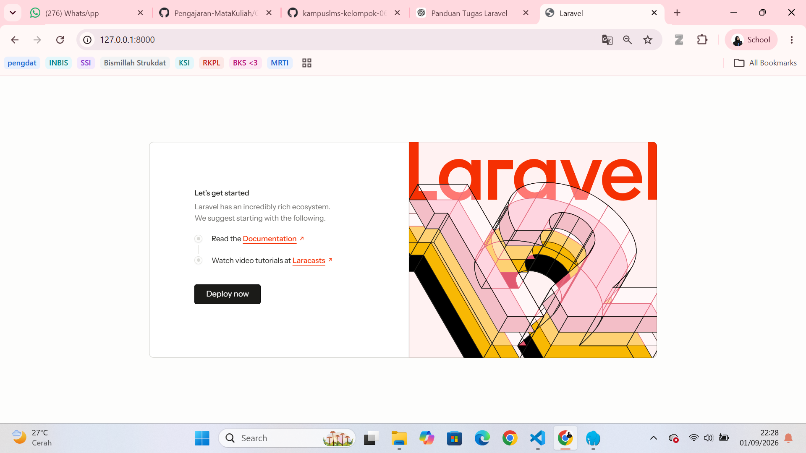
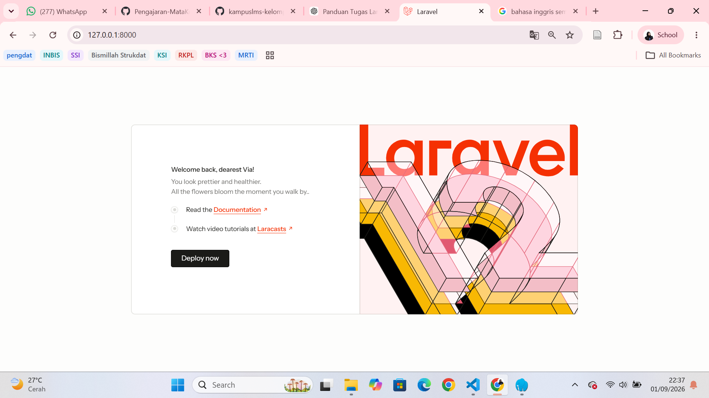
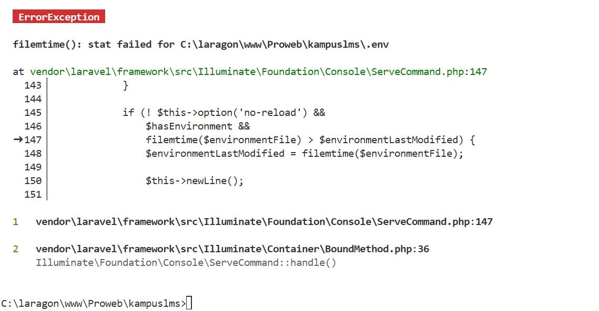
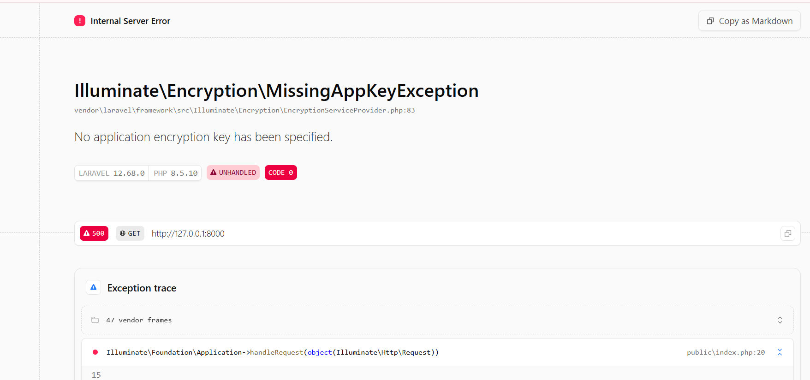
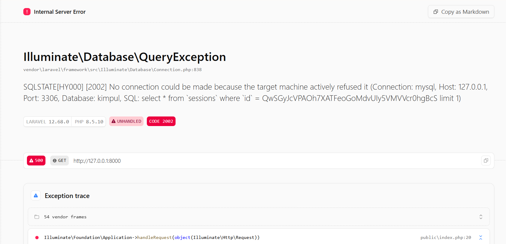
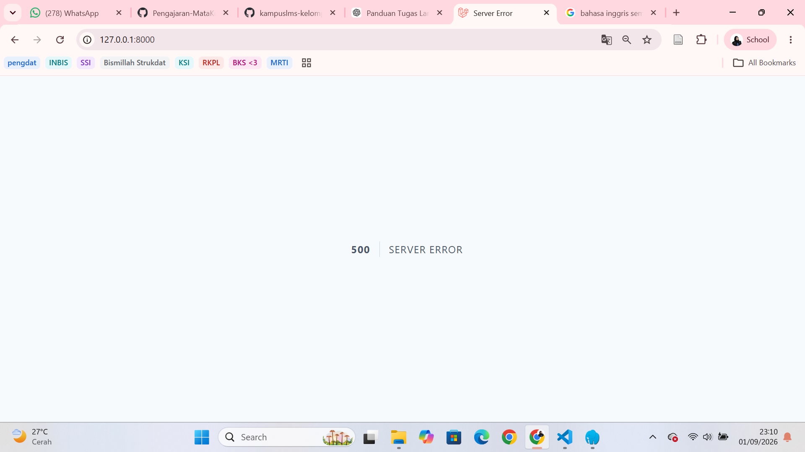

## Oktavia Nur Rahmadani
### NIM 10241060
### Pemrograman Web

**1. Buka `public/index.php`. Baca dari atas ke bawah. Tulis dalam 3 kalimat apa yang dilakukan berkas ini.**
Jawaban: 
Berkas public/index.php merupakan pintu masuk utama aplikasi Laravel. Berkas ini menyiapkan aplikasi dan memuat komponen yang diperlukan agar Laravel dapat berjalan. Setelah itu, setiap permintaan dari pengguna diteruskan ke Laravel untuk diproses dan menghasilkan halaman atau respons yang sesuai.

**2. Buka `bootstrap/app.php`. Identifikasi bagian mana yang mengurus route, mana yang mengurus middleware, mana yang mengurus exception.**
Jawaban: Dalam kode tersebut terdapat tiga bagian yang memiliki fungsi berbeda, yaitu routing, middleware, dan exception.
- Routing
```return Application::configure(basePath: dirname(__DIR__))
    ->withRouting(
        web: __DIR__.'/../routes/web.php',
        commands: __DIR__.'/../routes/console.php',
        health: '/up',
    )
```
Bagian ini mengatur jalur atau alamat yang bisa diakses dalam aplikasi. 

- Middleware
```
->withMiddleware(function (Middleware $middleware) {
    //
})
```
Bagian ini digunakan untuk mengecek atau menyaring request sebelum diproses oleh aplikasi.

- Exception
```
->withExceptions(function (Exceptions $exceptions) {
        //
    })
```
Bagian ini digunakan untuk mengatur penanganan error atau kesalahan yang terjadi saat aplikasi berjalan.

**3. Buka `routes/web.php`. Temukan route yang menghasilkan halaman selamat datang. Ubah teksnya, muat ulang browser, pastikan berubah.**
Jawaban: Pada file routes/web.php, terdapat route yang menentukan halaman apa yang akan ditampilkan ketika pengguna membuka halaman utama Laravel. Route ini dapat diubah untuk mengganti tampilan atau teks yang muncul di browser.
- Tampilan sebelum diubah

- Tampilan setelah diubah


**4. Jalankan `php artisan route:list`. Cocokkan keluarannya dengan isi `routes/web.php`.**
Jawaban: 
- `php artisan route:list`
```
C:\laragon\www\Proweb\kampuslms>php artisan route:list

  GET|HEAD  / ........................................................................ routes/web.php:5
  GET|HEAD  storage/{path} storage.local › vendor/laravel/framework/src/Illuminate/Filesystem/Filesyst…
  PUT       storage/{path} storage.local.upload › vendor/laravel/framework/src/Illuminate/Filesystem/F…
  GET|HEAD  up vendor/laravel/framework/src/Illuminate/Foundation/Configuration/ApplicationBuilder.php…

                                                                                     Showing [4] routes
```
- `routes/web.php`
```
<?php

use Illuminate\Support\Facades\Route;

Route::get('/', function () {
    return view('welcome');
});
```
Hasil php artisan route:list menunjukkan route GET|HEAD / yang berasal dari routes/web.php baris 5. Hal ini sesuai dengan isi routes/web.php, yaitu Route::get('/'), sehingga route yang dibuat pada file tersebut sudah terdaftar dengan benar.

| # | Yang dirusak | Prediksi Anda sebelum mencoba | Pesan error sebenarnya |
|---|--------------|-------------------------------|------------------------|
| 1 | Ganti nama `.env` menjadi `.env.bak` | Laravel kemungkinan mengalami error karena konfigurasi tidak ditemukan |  |
| 2 | Kosongkan nilai `APP_KEY` di `.env` | Keamanan website tidak dapat digunakan dengan baik. | |
| 3 | Ubah `DB_DATABASE` menjadi nama yang tidak ada | Website tidak dapat terhubung ke database karena tidak tersedia. |  |
| 4 | Ubah `APP_DEBUG=false`, lalu ulangi nomor 3 | Website menampikan data error lebih sedikit. | |