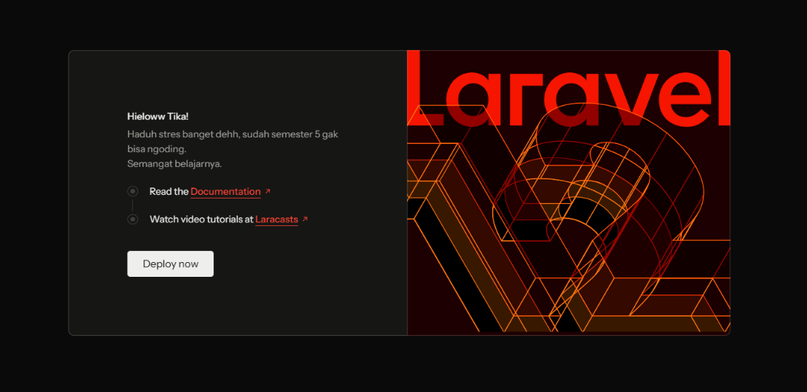
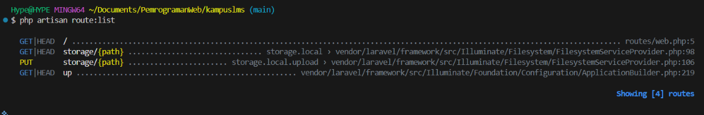
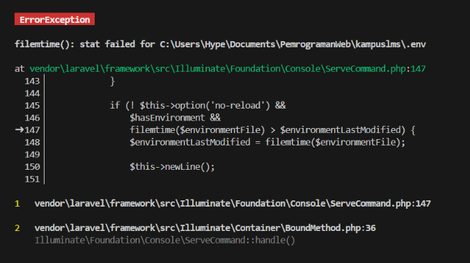
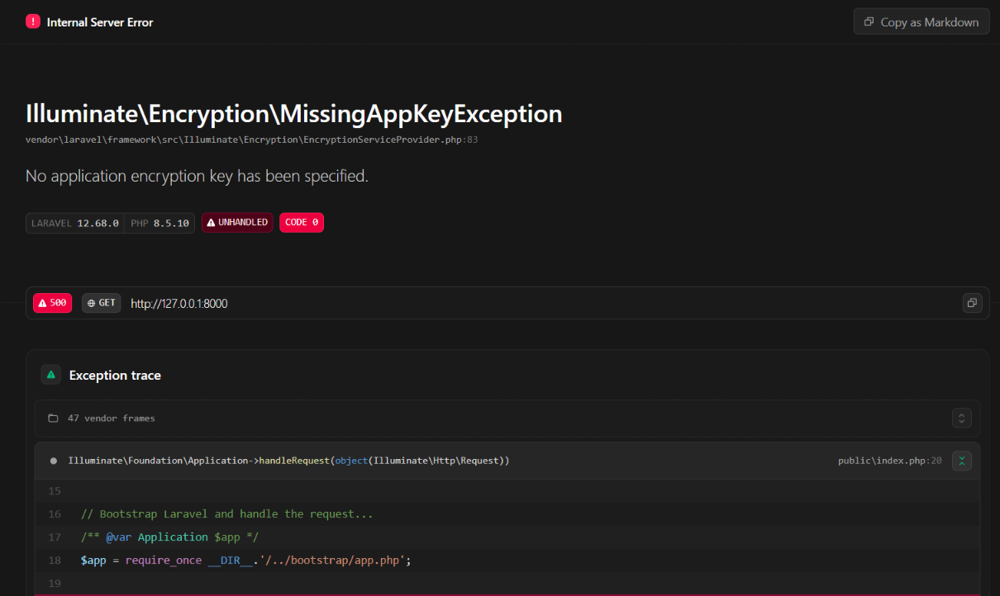
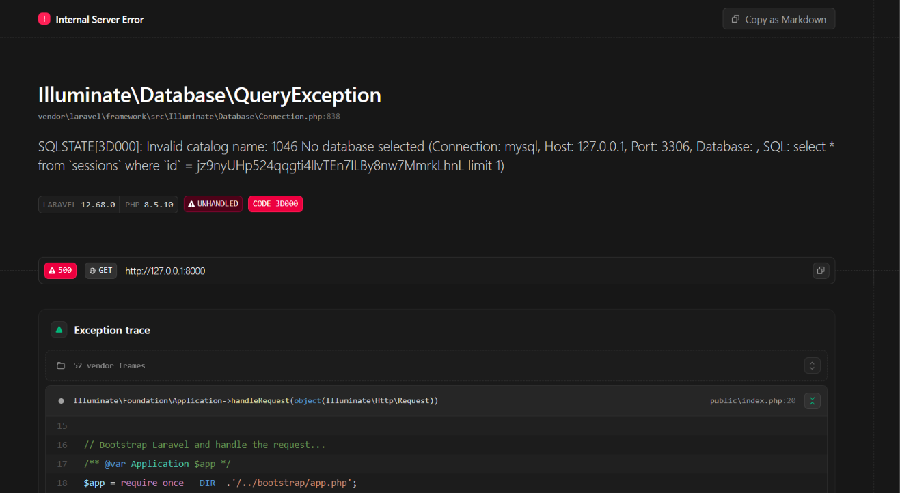
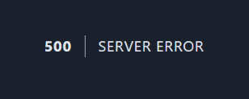

**1. Buka `public/index.php`. Baca dari atas ke bawah. Tulis dalam 3 kalimat apa yang dilakukan berkas ini.**

Jawaban:

Berkas ini fungsinya sebagai pintu gerbang utama yang menyambut setiap pengunjung yang membuka website kita.
Saat ada permintaan masuk, berkas ini menyiapkan dan menyalakan seluruh mesin Laravel beserta komponen pendukungnya.
Setelah mesin siap, berkas ini memproses permintaan tersebut lalu mengirimkan hasilnya kembali ke layar browser pengunjung.

**2. Buka `bootstrap/app.php`. Identifikasi bagian mana yang mengurus route, mana yang mengurus middleware, mana yang mengurus exception.**

Jawaban:

* Route ditangani oleh:
  
    ```php
    withRouting(
            web: __DIR__.'/../routes/web.php',
            commands: __DIR__.'/../routes/console.php',
            health: '/up',
    ```

    Digunakan untuk memberi tahu Laravel lokasi file-file route yang digunakan oleh aplikasi.

* Middleware ditangani oleh:
  ```php
  withMiddleware(function (Middleware $middleware) {
        //
    })
  ```
    Digunakan untuk memeriksa atau memproses request sebelum diteruskan ke aplikasi.
    Contohnya, middleware bisa digunakan untuk memeriksa apakah pengguna sudah login atau belum sebelum boleh mengakses halaman tertentu.

* Exception ditangani oleh:
  ```php
    withExceptions(function (Exceptions $exceptions) {
        //
    })->create();

  ```

  Digunakan untuk mengatur penanganan error pada aplikasi Laravel.
  Misalnya, menentukan bagaimana error ditampilkan atau dicatat ketika terjadi kesalahan.

**3. Buka `routes/web.php`. Temukan route yang menghasilkan halaman selamat datang. Ubah teksnya, muat ulang browser, pastikan berubah.**

Jawaban:

**Tampilan sebelum di edit**


**Tampilan sesudah diedit**



`routes/web.php` berfungsi mengarahkan URL ke halaman yang sesuai. Pada kasus ini, path `/` mengarah ke halaman welcome yang tampilannya diatur di `resources/views/welcome.blade.php`. Jadi, untuk mengubah tampilan halaman utama, edit file welcome.blade.php.

**4. Jalankan `php artisan route:list`. Cocokkan keluarannya dengan isi `routes/web.php`.**

Jawaban:

**php artisan route:list**



**web.php**

```php
<?php


use Illuminate\Support\Facades\Route;


Route::get('/', function () {
    return view('welcome');
});
```

Diujung kanan terminal tertulis `routes/web.php:5`, ini memberitahu secara persis bahwa rute tersebut didaftarkan pada file `routes/web.php` mulai dari baris ke 5.


| # | Yang dirusak | Prediksi Anda sebelum mencoba | Pesan error sebenarnya |
|---|--------------|-------------------------------|------------------------|
| 1 | Ganti nama `.env` menjadi `.env.bak` |Laravel akan error dan tidak muncul halaman welcome. Atau muncul error yang bilang database tidak ditemukan. | |
| 2 | Kosongkan nilai `APP_KEY` di `.env` |Kode rahasia di laravel bakal terlihat orang lain| |
| 3 | Ubah `DB_DATABASE` menjadi nama yang tidak ada | Tidak bisa mengakses database dan terjadi error karena bingung harus akses database yang mana karena tidak ada namanya| |
| 4 | Ubah `APP_DEBUG=false`, lalu ulangi nomor 3 |Informasi error tidak muncul | |
