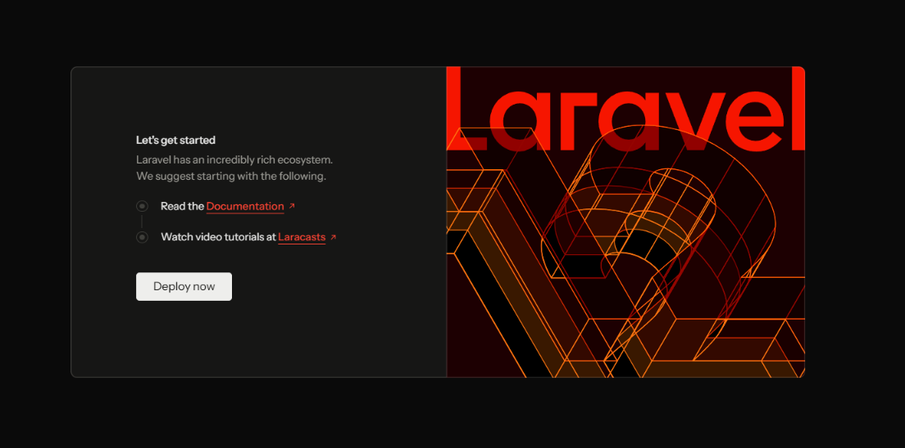
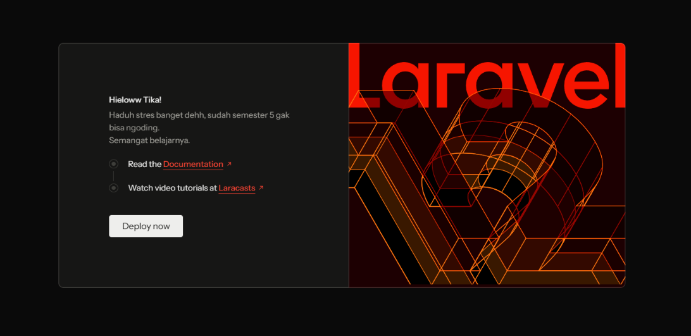
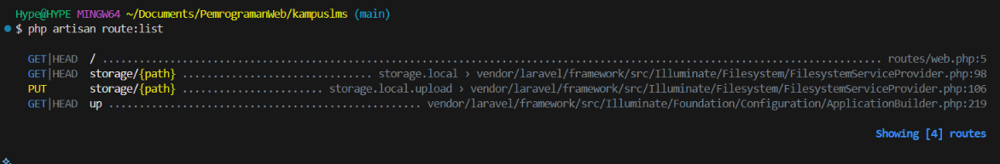
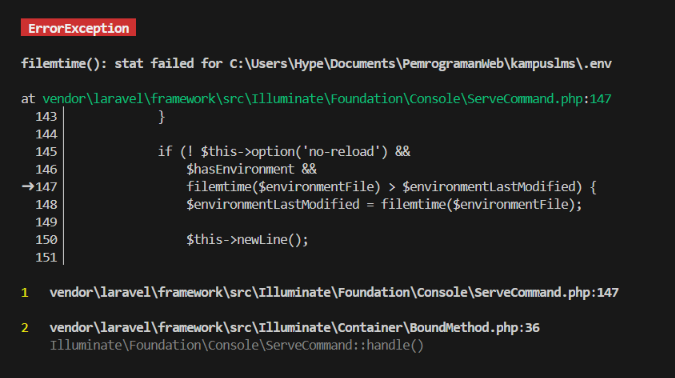
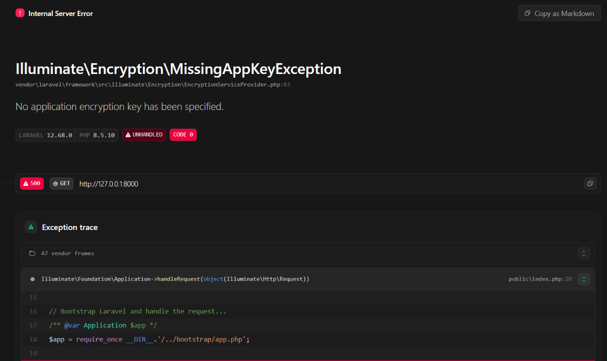
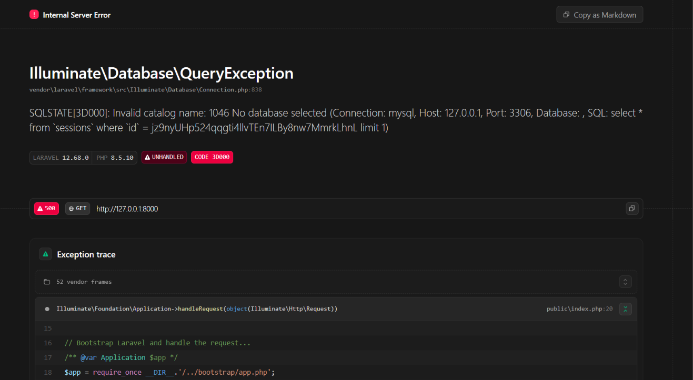
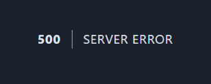

## Nama: Tika Mila Wahyuni

## NIM: 10241070

# READ

### 1. Buka `public/index.php`. Baca dari atas ke bawah. Tulis dalam 3 kalimat apa yang dilakukan berkas ini.

Jawaban:

Berkas ini fungsinya sebagai pintu gerbang utama yang menyambut setiap pengunjung yang membuka website kita.
Saat ada permintaan masuk, berkas ini menyiapkan dan menyalakan seluruh mesin Laravel beserta komponen pendukungnya.
Setelah mesin siap, berkas ini memproses permintaan tersebut lalu mengirimkan hasilnya kembali ke layar browser pengunjung.

### 2. Buka `bootstrap/app.php`. Identifikasi bagian mana yang mengurus route, mana yang mengurus middleware, mana yang mengurus exception.

Jawaban:

* Route ditangani oleh:
  
    ```php
    withRouting(
            web: __DIR__.'/../routes/web.php',
            commands: __DIR__.'/../routes/console.php',
            health: '/up',
    ```

    Digunakan untuk memberi tahu Laravel lokasi file-file route yang digunakan oleh aplikasi.

* Middleware ditangani oleh:
  ```php
  withMiddleware(function (Middleware $middleware) {
        //
    })
  ```
    Digunakan untuk memeriksa atau memproses request sebelum diteruskan ke aplikasi.
    Contohnya, middleware bisa digunakan untuk memeriksa apakah pengguna sudah login atau belum sebelum boleh mengakses halaman tertentu.

* Exception ditangani oleh:
  ```php
    withExceptions(function (Exceptions $exceptions) {
        //
    })->create();

  ```

  Digunakan untuk mengatur penanganan error pada aplikasi Laravel.
  Misalnya, menentukan bagaimana error ditampilkan atau dicatat ketika terjadi kesalahan.

### 3. Buka `routes/web.php`. Temukan route yang menghasilkan halaman selamat datang. Ubah teksnya, muat ulang browser, pastikan berubah.

Jawaban:

**Tampilan sebelum di edit**



**Tampilan sesudah diedit**



`routes/web.php` berfungsi mengarahkan URL ke halaman yang sesuai. Pada kasus ini, path `/` mengarah ke halaman welcome yang tampilannya diatur di `resources/views/welcome.blade.php`. Jadi, untuk mengubah tampilan halaman utama, edit file `welcome.blade.php`.

### 4. Jalankan `php artisan route:list`. Cocokkan keluarannya dengan isi `routes/web.php`.

Jawaban:

**php artisan route:list**



**web.php**

```php
<?php


use Illuminate\Support\Facades\Route;


Route::get('/', function () {
    return view('welcome');
});
```

Diujung kanan terminal tertulis `routes/web.php:5`, ini memberitahu secara persis bahwa rute tersebut didaftarkan pada file `routes/web.php` mulai dari baris ke 5.

# BREAK
| # | Yang dirusak | Prediksi Anda sebelum mencoba | Pesan error sebenarnya |
|---|--------------|-------------------------------|------------------------|
| 1 | Ganti nama `.env` menjadi `.env.bak` |Laravel akan error dan tidak muncul halaman welcome. Atau muncul error yang bilang database tidak ditemukan. | Aplikasi mengalami error karena file `.env` tidak ditemukan atau tidak dapat dibaca oleh Laravel.|
| 2 | Kosongkan nilai `APP_KEY` di `.env` |Kode rahasia di laravel bakal terlihat orang lain|  Aplikasi mengalami error karena `APP_KEY` sebagai kunci keamanan/enkripsi Laravel belum tersedia atau belum dikonfigurasi di dalam file `.env`.|
| 3 | Ubah `DB_DATABASE` menjadi nama yang tidak ada | Tidak bisa mengakses database dan terjadi error karena bingung harus akses database yang mana karena tidak ada namanya|  error karena database MySQL belum dipilih atau nama database pada konfigurasi .env belum diisi dengan benar, sehingga Laravel tidak dapat mengakses tabel sessions.|
| 4 | Ubah `APP_DEBUG=false`, lalu ulangi nomor 3 |Informasi error tidak muncul | Detail penyebab error disembunyikan.|


# FIX - w01


### 1. **Masalah Konfigurasi 1 :** Berkas `.env` belum dibuat dan `APP_KEY` kosong.

**Penyebab:** Di repositori Git, hanya ada berkas `.env`. Jika aplikasi langsung dijalnkan (`php artisan serve`), laravel langsung menampilkan pesan error `MissingAppKeyException`.  

**Solusi:**  
- Buat berkas `.env` dari berkas `.env.example`.  
- Jalankan `php artisan key:generate` untuk membuat `APP_KEY`. 

### 2. **Masalah Konfigurasi 2:** Konfigurasi Database & Session Bentrok di `.env.example`.

**Penyebab:** Pada `.env.example`, konfigurasi default nya adalah `DB_CONNECTION=sqlite`, tetapi berkas databse SQLite tidak ada di repo. Disaat yang sama `SESSION_DRIVER=database` dan `CACHE_STORE=database` dalam keadaan aktif. Ketika ada request masuk ke web, Laravel langsung mencari tabel `sessions` ke file SQLite yang tidak ada, sehingga muncul error. Sesuai modul praktikum dan `PANDUAN_SETUP.md`, standar database yang digunakan adalah MySQL (`kampus_db`).

**Solusi Perbaikan:** Sesuaikan bagian database di file `.env.example` dan `.env` agar mengarah ke MySQL:

```
DB_CONNECTION=mysql
DB_HOST=[IP_ADDRESS]
DB_PORT=3306
DB_DATABASE=kampus_db
DB_USERNAME=root
DB_PASSWORD=
```
Lalu jalankan migrasi database: `php artisan migrate`.

### 3. **Masalah Dependensi:** `minimum-stability` diatur ke `"dev"` pada `composer.json`.

**Penyebab:** Pada baris ke 72 di file composer.json: `"minimum-stability" : "dev"`. Pengaturan `"dev"` memungkinkan Composer mengunduh paket dependensi yang belum stabil (versi alpha/beta/dev branch), yang berisiko menimbulkan breaking changes atau celah keamanan sewaktu-waktu saat `composer update` atau penambahan paket baru. Standar resmi Laravel adalah `"stable"`.

**Solusi Perbaikan:** Ubah nilainya menjadi `"stable"` di file composer.json (`"minimum-stability": "stable"`). Lalu jalankan instalasi dependensi Composer (`composer install`).

### 4. **Satu berkas yang seharusnya tidak ada:** `package-lock.json`.

**Penyebab:** Pada commit f29fa50 ("add week 1"), berkas package-lock.json ikut ter-commit ke dalam repositori dengan nama project "name": "kampus".

**Dampak:**
- Berkas ini adalah sisa lockfile dari mesin developer lokal sebelumnya (bukan kerangka bersih Laravel).
- Saat mahasiswa lain menjalankan `npm install`, lockfile ini langsung termodifikasi otomatis (git status mendeteksi file kotor/berubah) dan dapat menimbulkan dependency mismatch.

**Solusi Perbaikan:** Hapus file `package-lock.json`.
Kemudian jalankan instalasi paket frontend: `npm install`.


