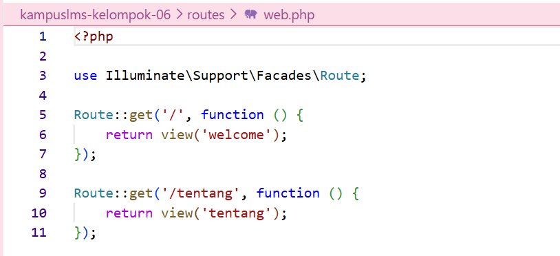
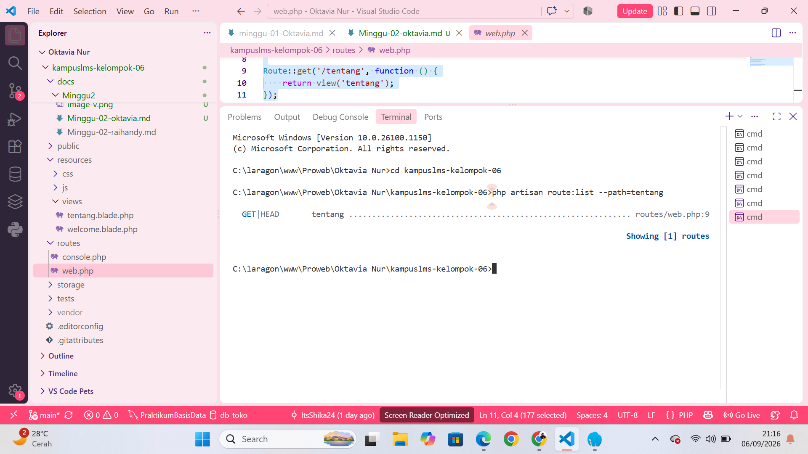

## Oktavia Nur Rahmadani
### NIM 10241060
### Pemrograman Web

**1. Baris mana di routes/web.php yang menangkapnya?**
Jawaban: Route `/tentang` ada di baris 9 pada `routes/web.php`


**2. Kalau ditangani controller, berkas dan method mana?**
Jawaban: Pada route `/tentang`, tidak ada Controller yang digunakan karena route tersebut langsung menjalankan `function()` dan memanggil `view('tentang').`
```
Route::get('/tentang', function () {
    return view('tentang');
});
```

**3. View mana yang dikembalikan? Di path apa persisnya?**
Jawaban: View yang dikembalikan adalah tentang, yang berasal dari file `tentang.blade.php.` File tersebut berada pada path `resources/views/tentang.blade.php.`
```
Route::get('/tentang', function () {
    return view('tentang');
});
```

**4. Layout apa yang membungkusnya?**
Jawaban: Tidak ada layout yang digunakan. Halaman `/tentang` langsung menggunakan isi dari `tentang.blade.php`, yang sudah memiliki struktur HTML sendiri.

**5. Jalankan php artisan route:list --path=tentang. Cocok dengan analisis Anda?**
Jawaban: Cocok dengan analisis karena route /tentang menggunakan method GET dan terdapat pada routes/web.php baris 9.
