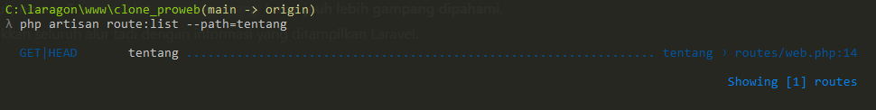
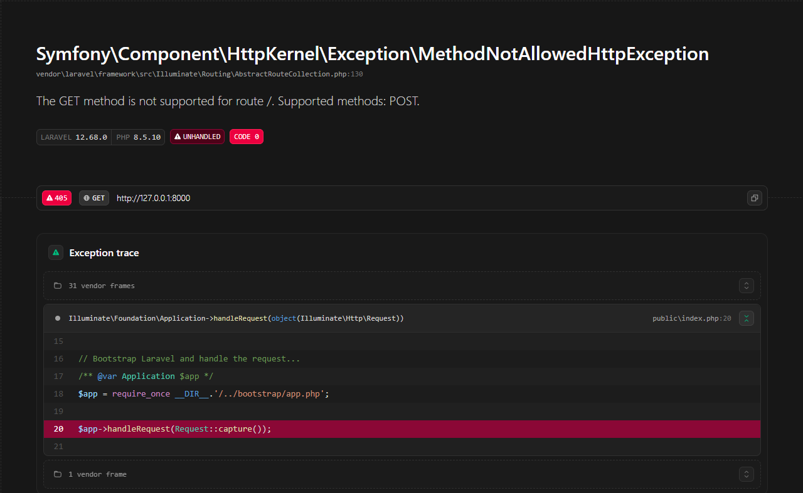
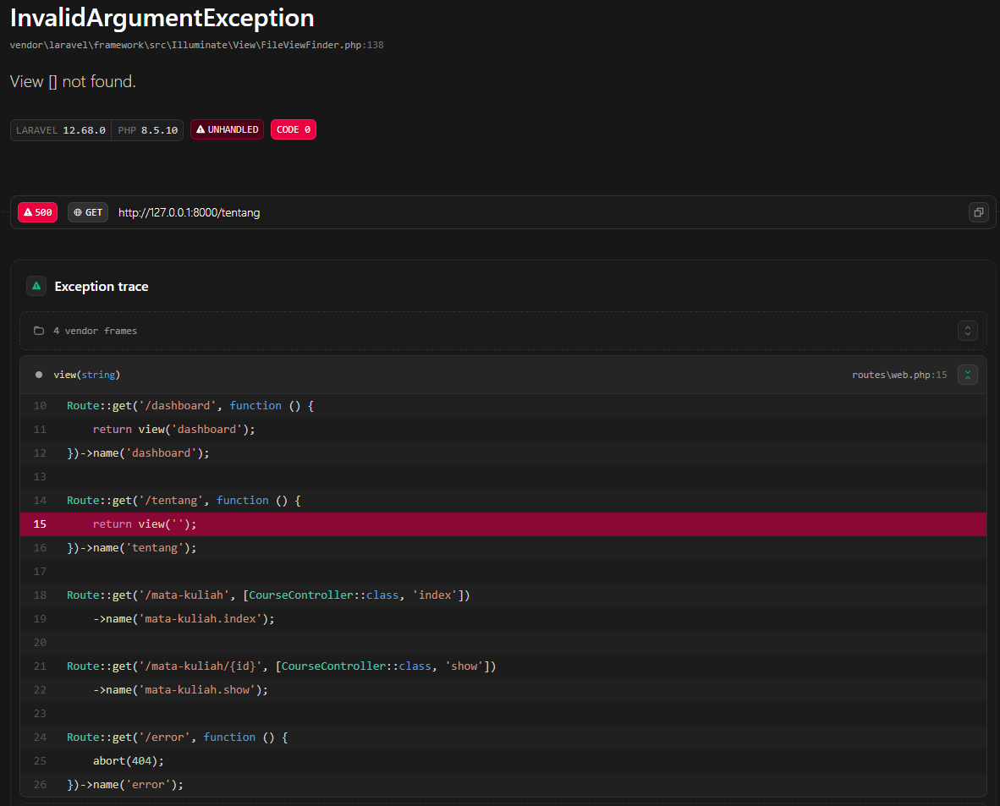
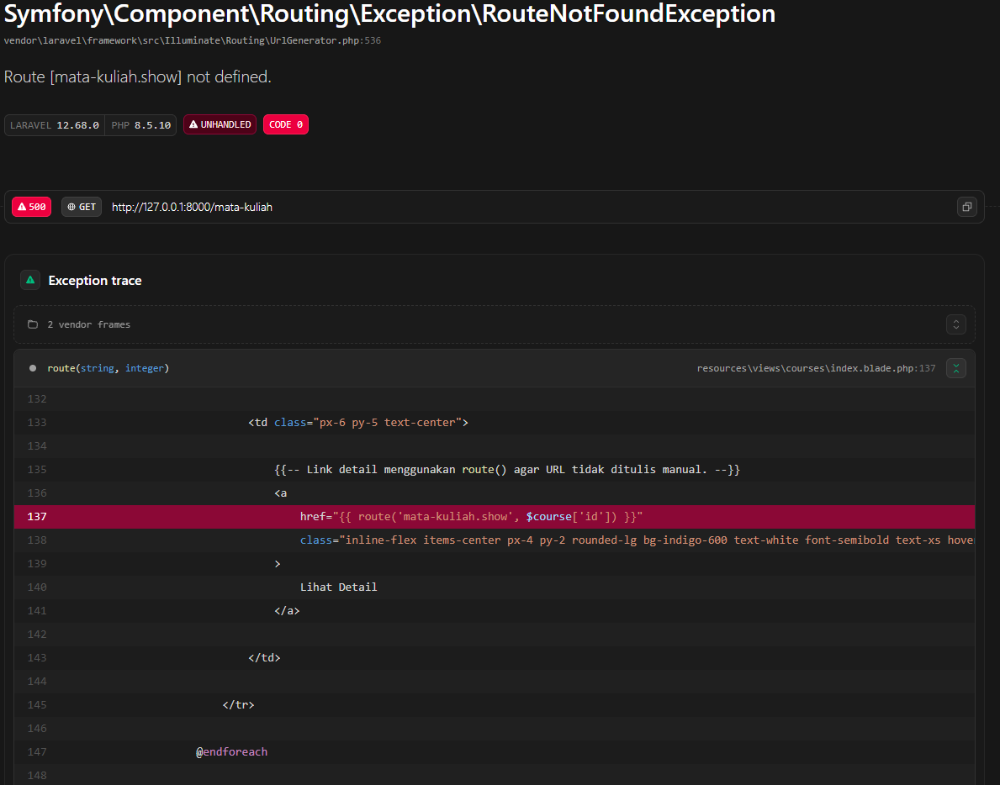
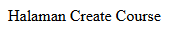
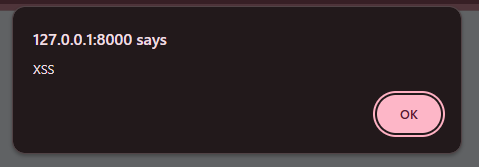
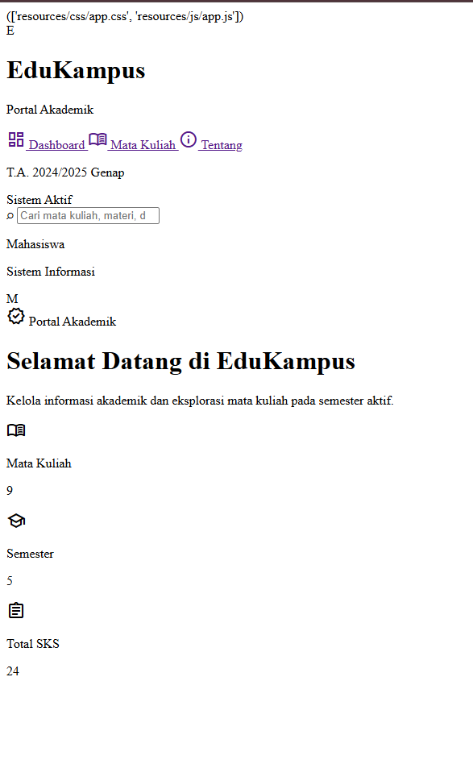
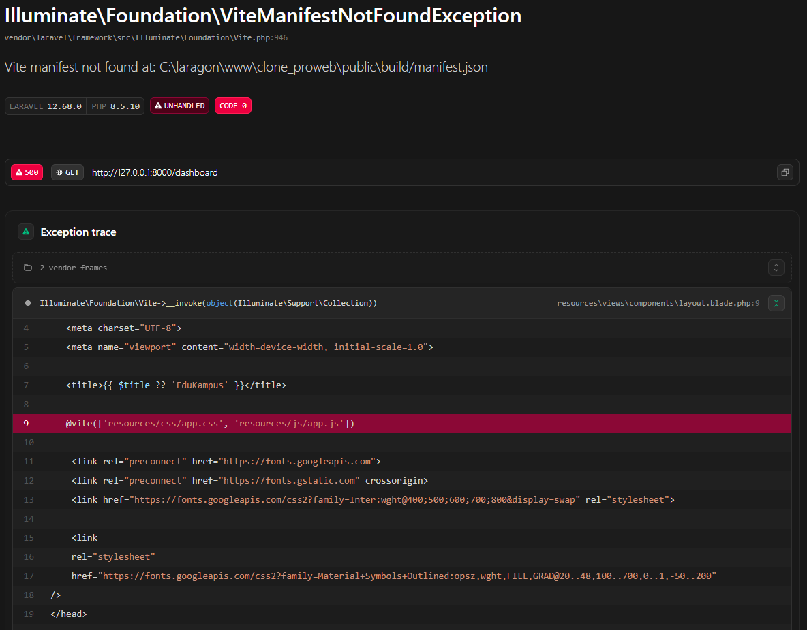
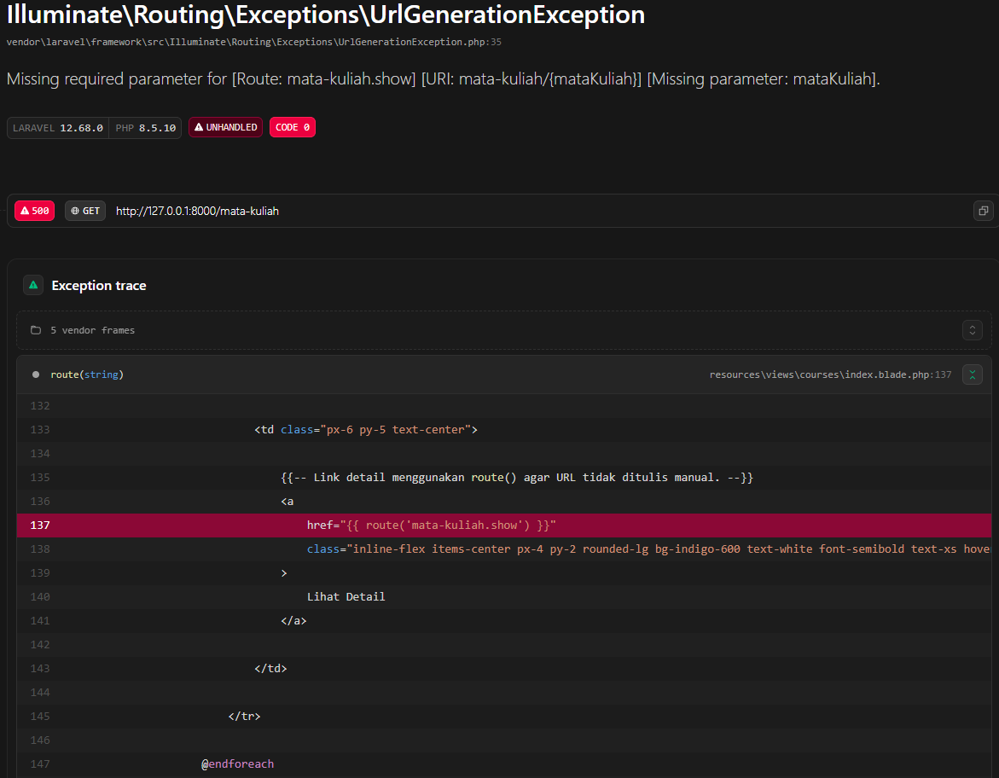

## Catatan Minggu 2

1. **Baris mana di `routes/web.php` yang menangkapnya?**

`/tentang` diambil dari code di `web.php`

```php
Route::get('/tentang', function () {
    return view('tentang');
})->name('tentang');
```

---
**2. Kalau ditangani controller, berkas dan method mana?**

`/tentang` diatur di dalam route bukan di controller, jika diatur kedalam controller maka code akan menambahkan kode method dan class didalamnya dan di taruh kedalam folder `controller`

---
**3. View mana yang dikembalikan? Di path apa persisnya?**

di route `/tentang` terdapat kode
```php
return view('tentang');
```
di kode ini mengembalikan view ke tentang yang mana tentang itu di muat di `tentang.blade.php` di path `resources/views/tentang.blade.php`

---
**4. Layout apa yang membungkusnya?**

didalam project ini `tentang.blade.php` di bungkus dengan `x-layout` yang diatur di `layout.blade.php`, yang ini adalah fungsi dari laravel untuk mengatur tampilan melalui blade componen perintah `x-` adalah tanda kita memanggil fungsi blade ini.

---
**5. Jalankan php artisan route:list --path=tentang. Cocok dengan analisis Anda?**


hasil dari `php artisan route:list --path=tentang` menunjukkan `/tentang` di jalankan melalui `routes/web.php:14` yang artinya ini sejalan bahwa `/tentang` dijalankan melalui route yang dijalankan di line 14 pada `web.php`.


| # | Yang dirusak | hipotesis | Gambar | Analisis |
| --- | --- | --- | --- | --- |
| 1 | Ubah `Route::get` menjadi `Route::post` pada route daftar mata kuliah | Web bisa jalan namun tidak bisa memuat recourse |  | terjadi error karena browser mengirim request menggunakan method `GET`, sedangkan route tersebut hanya menerima method `POST`. |
| 2 | Ubah nama view di `return view(...)` menjadi yang tidak ada | terjadi error karena web tidak dapat menampilkan resources |  | error `View [] not found` karena Laravel mencari file view berdasarkan nama yang diberikan pada `view( )` |
| 3 | Hapus `->name('courses.show')`, lalu muat halaman yang memakai `route('courses.show')` | terjadi error karena tidak dapat menampilkan matakuliah yang ada di resource |  | error `Route [mata-kuliah.show] not defined` karena link pada view menggunakan `route('mata-kuliah.show', ...)`, sedangkan route tersebut sudah tidak memiliki nama `mata-kuliah.show` |
| 4 | Pindahkan `/courses/{course}` ke ATAS `/courses/create`, lalu buka `/courses/create` | tidak terjadi apa apa |  | `/courses/create` awalnya dianggap sebagai `course = create`, kemudian setelah urutan diperbaiki, `/courses/create` menjalankan route create yang sebenarnya.
| 5 | Ganti `{{ $nama }}` menjadi `{!! $nama !!}`, isi `$nama` dengan `<script>alert('XSS')</script>` | muncul peringatan |  | `{{ }}` otomatis escape HTML (aman), `{!! !!}` render mentah sehingga script ikut dieksekusi browser → celah XSS
| 6 | Hapus `@vite(...)` dari layout | terjadi error karena tidak dapat memuat halaman |  | Halaman tetap terbuka tapi tanpa ui karena `vite()` yang mencetak tag `<link>/<script>` ke aset |
| 7 | Hentikan `npm run dev` lalu muat ulang halaman | tidak dapat menjalankan fungsi `@vite` |  | CSS/JS gagal dimuat, error di console karena Saat dev aktif, aset diarahkan ke Vite dev server, begitu dimatikan request ke situ gagal
| 8 | Panggil `route('courses.show')` tanpa mengirim parameter | Error |  | Route ini butuh parameter wajib `{mataKuliah}` tanpa nilai, Laravel tak bisa bentuk URL |