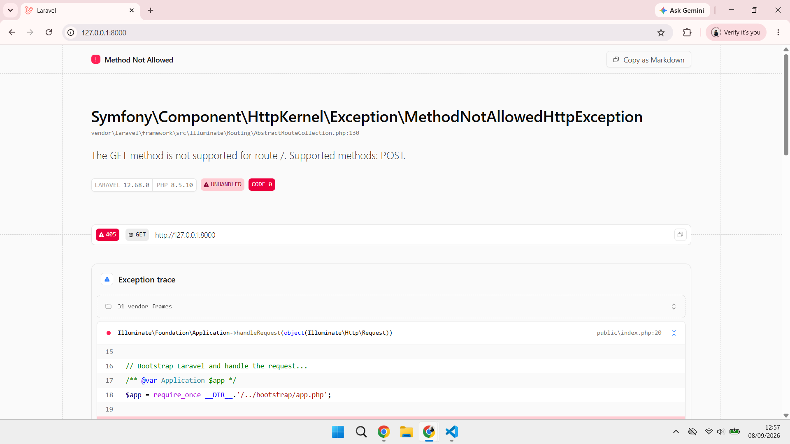
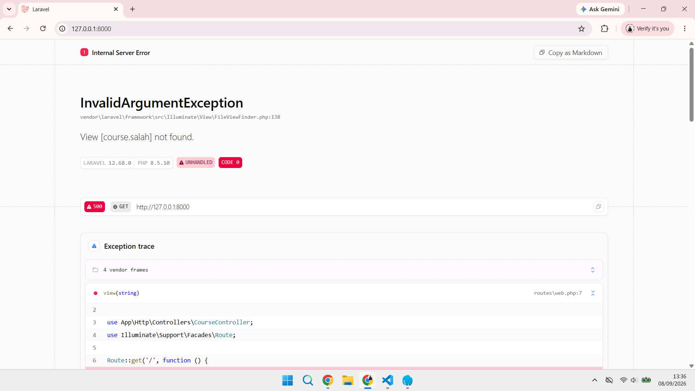
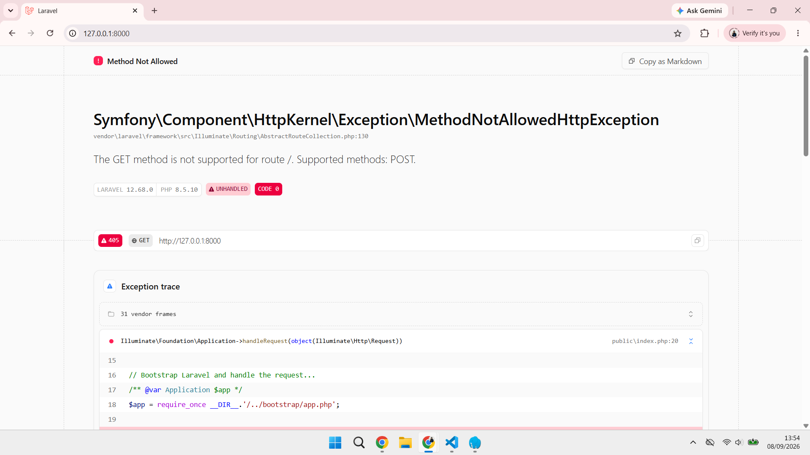
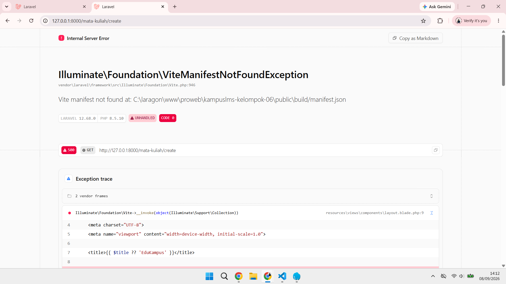
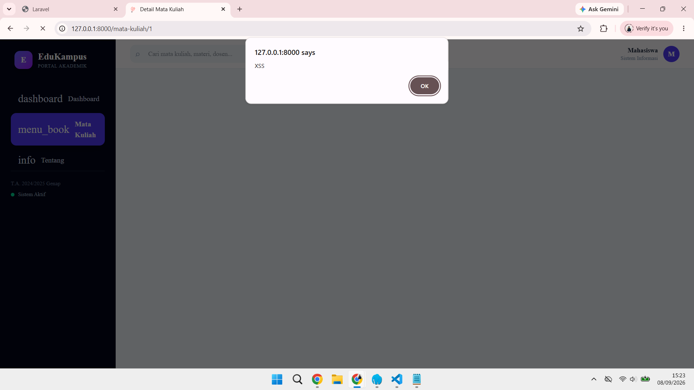
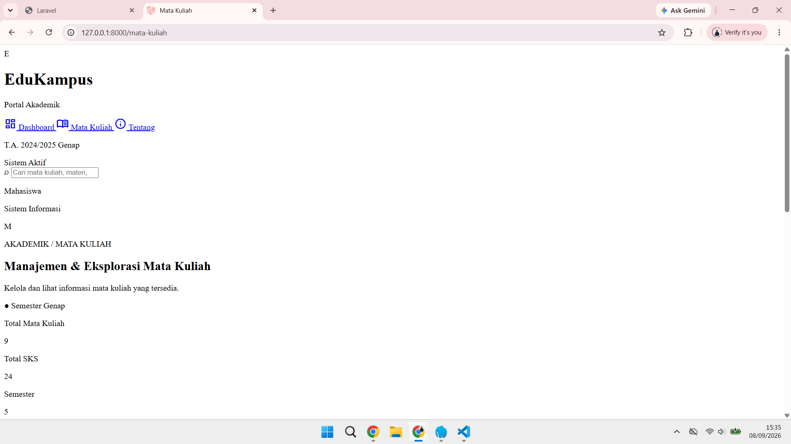
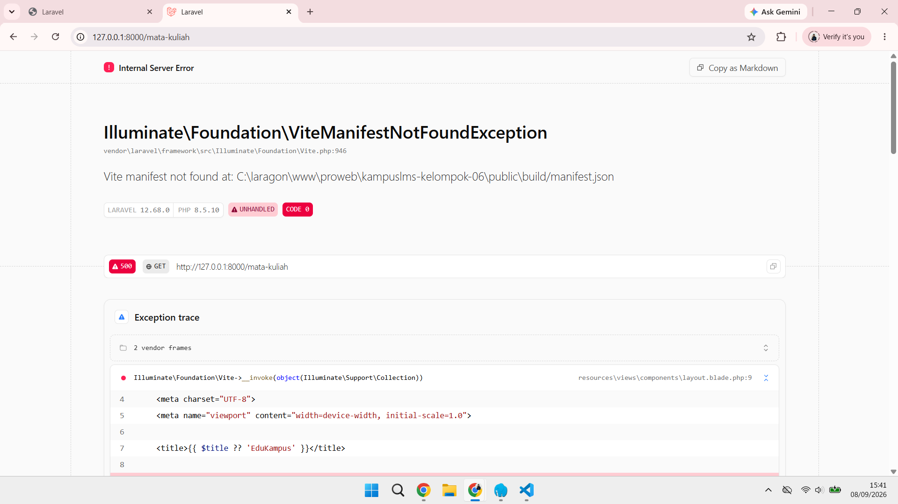
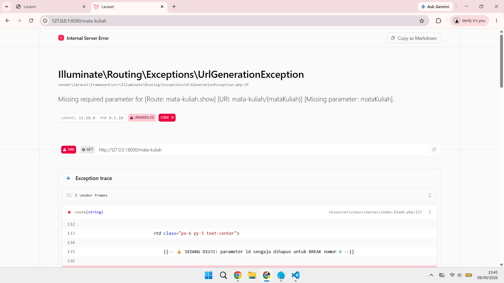

## Catatan Minggu 2 Pemrograman Web

### READ

**1. Baris mana di `routes/web.php` yang menangkapnya?**

Jawaban : Pada baris ke 11 `routes/web.php`, ada route yang mengatur halaman `/tentang`.


**2.Kalau ditangani controller, berkas dan method mana?**

Jawaban : Pada route `/tentang`, controller tidak digunakan karena route langsung memproses permintaan dengan `function()` kemudian menampilkan `view('tentang')`.
```php
Route::get('/tentang', function () {
    return view('tentang');
});
```


**3. View mana yang dikembalikan? Di path apa persisnya?**

Jawaban : Route `/tentang` mengembalikan view `tentang`. View tersebut ada di dalam file `tentang.blade.php` yang berada di folder `resources/views/tentang.blade.php`.


**4. Layout apa yang membungkusnya?**

Jawaban : Halaman `/tentang` tidak menggunakan layout khusus karena isi halaman sudah langsung ditulis di dalam `tentang.blade.php` dan sudah memiliki struktur HTML sendiri.


**5. Jalankan `php artisan route:list --path=tentang`. Cocok dengan analisis anda?**

Jawaban : Iya, hasilnya cocok. Hasil dari `php artisan route:list --path=tentang` sesuai dengan analisis sebelumnya. Route `/tentang` menggunakan `GET` dan langsung mengarah ke view `tentang` tanpa melalui controller.


---
### BREAK

| # | Yang dirusak | Prediksi Anda sebelum mencoba | Yang Anda Pelajari | Pesan Error Sebenarnya |
|---|--------------|-------------------------------|------------------------|--------------|
| 1 | Ubah `Route::get` menjadi `Route::post` pada route daftar mata kuliah | Halaman tidak bisa diakses/error | Method HTTP tidak cocok → 405 | 
| 2 | Ubah nama view di `return view(...)` menjadi yang tidak ada | Laravel akan error | Exception view not found |  |
| 3 | Hapus `->name('courses.show')`, lalu muat halaman yang memakai `route('courses.show')` | Tidak bisa diakses karena route ga punya nama | Kenapa nama route wajib | |
| 4 | Pindahkan `/courses/{course}` ke ATAS `/courses/create`, lalu buka `/courses/create` | Error karena urutan route salah | Urutan route menentukan |  |
| 5 | Ganti `{{ $nama }}` menjadi `{!! $nama !!}`, isi `$nama` dengan `<script>alert('XSS')</script>` | Mungkin akan terjadi error | XSS nyata di layar anda sendiri |  |
| 6 | Hapus `@vite(...)` dari layout | Desain tidak muncul, jadi halaman berubah | Aset tidak termuat |  |
| 7 | Hentikan `npm run dev` lalu muat ulang halaman | Saat npm run dev dihentikan, Vite tidak lagi menjalankan development server sehingga perubahan pada CSS dan JavaScript tidak bisa diproses seperti sebelumnya. | Beda dev server vs build | 
| 8 | Panggil `route('courses.show')` tanpa mengirim parameter | Data yang dikirim dari user atau request tidak bisa langsung dianggap aman. Data tersebut perlu dicek dan divalidasi terlebih dahulu sebelum digunakan. | Missing required parameter |  |