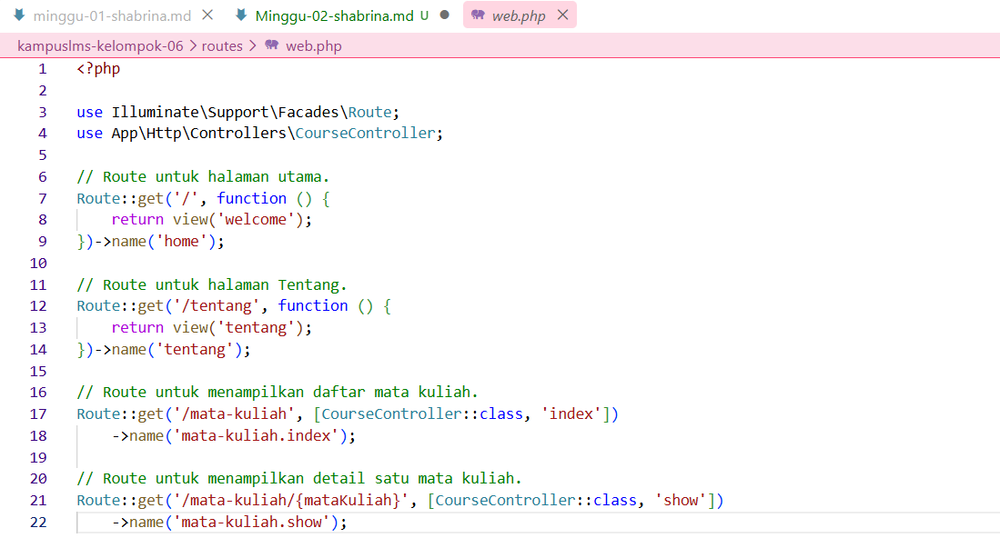
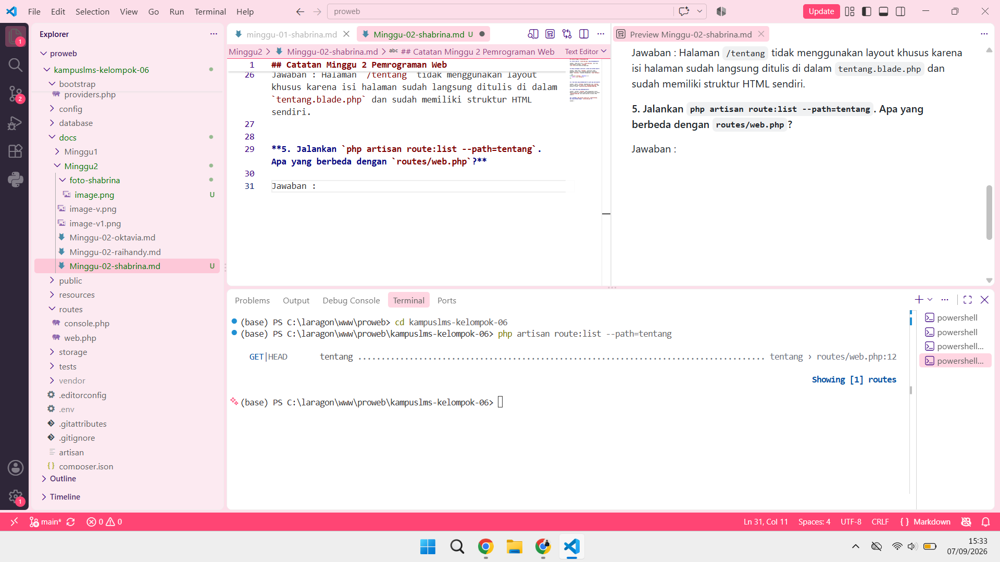

## Catatan Minggu 2 Pemrograman Web

**1. Baris mana di `routes/web.php` yang menangkapnya?**

Jawaban : Pada baris ke 11 `routes/web.php`, ada route yang mengatur halaman `/tentang`.



**2.Kalau ditangani controller, berkas dan method mana?**

Jawaban : Pada route `/tentang`, controller tidak digunakan karena route langsung memproses permintaan dengan `function()` kemudian menampilkan `view('tentang')`.
```php
Route::get('/tentang', function () {
    return view('tentang');
});
```


**3. View mana yang dikembalikan? Di path apa persisnya?**

Jawaban : Route `/tentang` mengembalikan view `tentang`. View tersebut ada di dalam file `tentang.blade.php` yang berada di folder `resources/views/tentang.blade.php`.


**4. Layout apa yang membungkusnya?**

Jawaban : Halaman `/tentang` tidak menggunakan layout khusus karena isi halaman sudah langsung ditulis di dalam `tentang.blade.php` dan sudah memiliki struktur HTML sendiri.


**5. Jalankan `php artisan route:list --path=tentang`. Cocok dengan analisis anda?**

Jawaban : Iya, hasilnya cocok. Hasil dari `php artisan route:list --path=tentang` sesuai dengan analisis sebelumnya. Route `/tentang` menggunakan `GET` dan langsung mengarah ke view `tentang` tanpa melalui controller.
