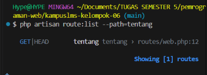
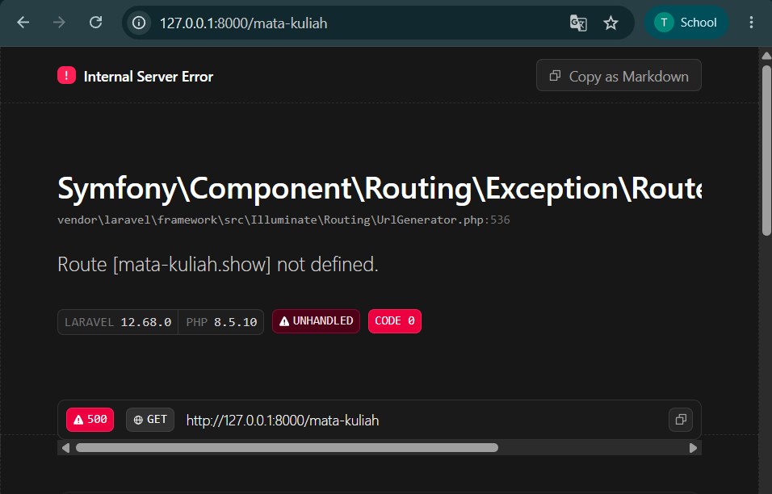
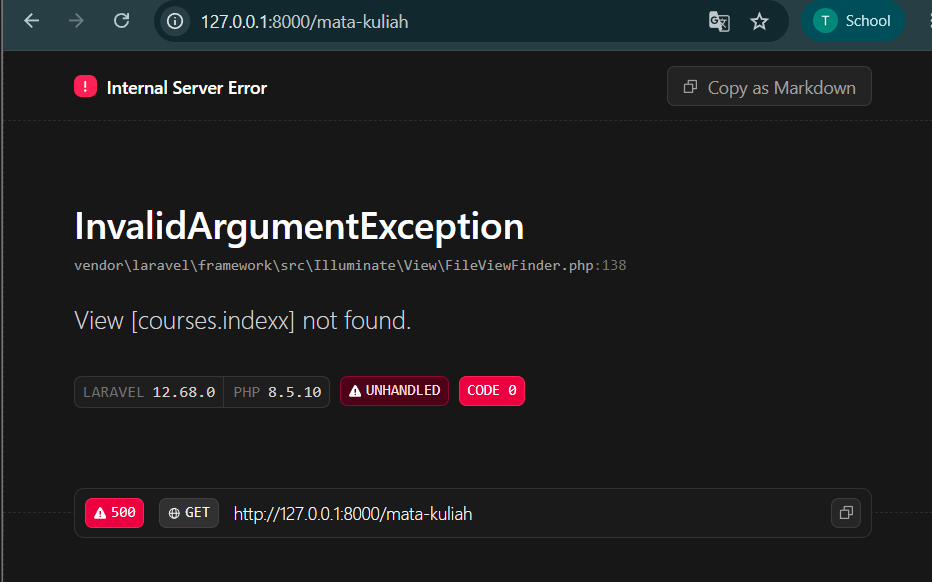
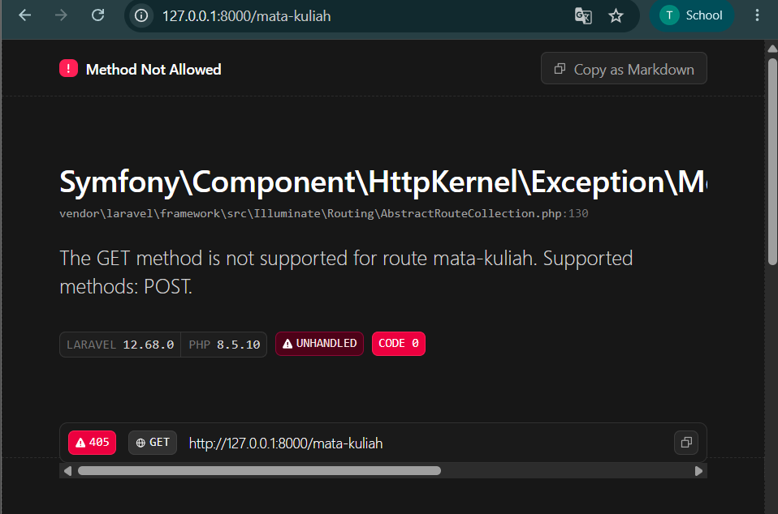
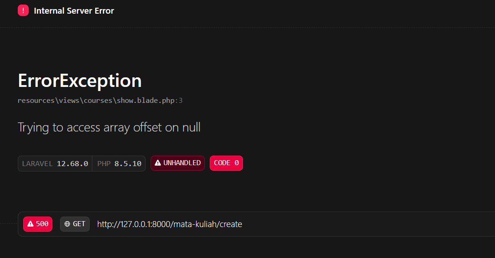
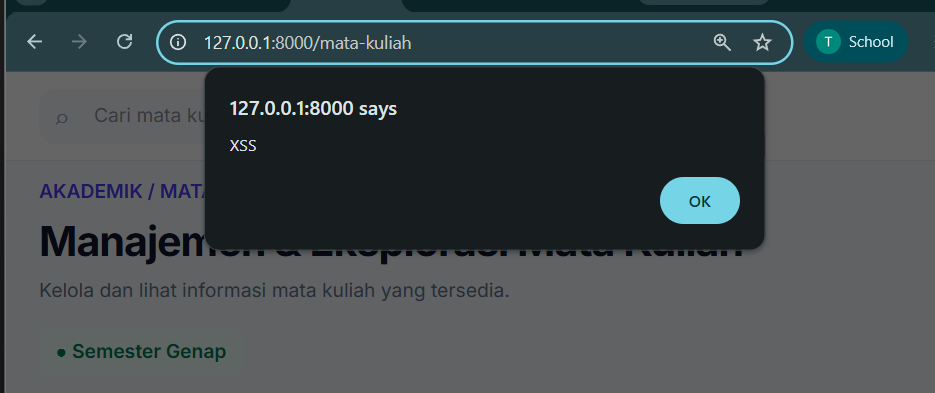
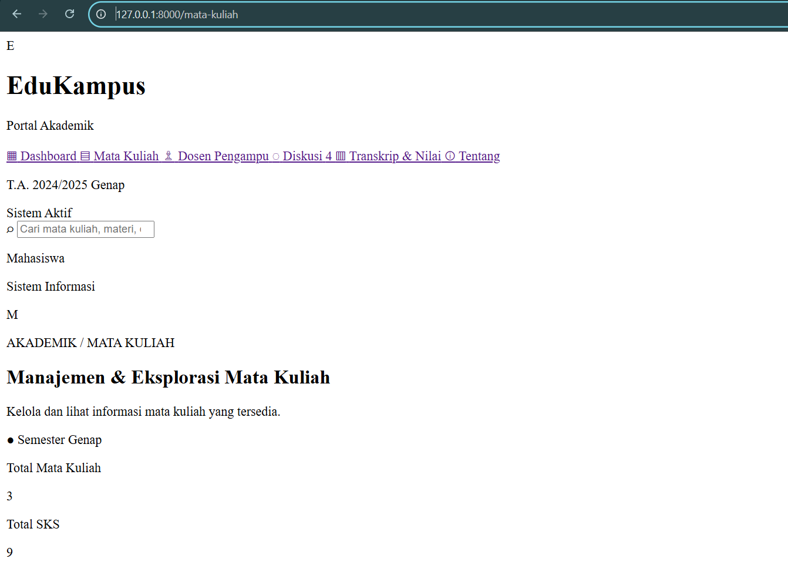
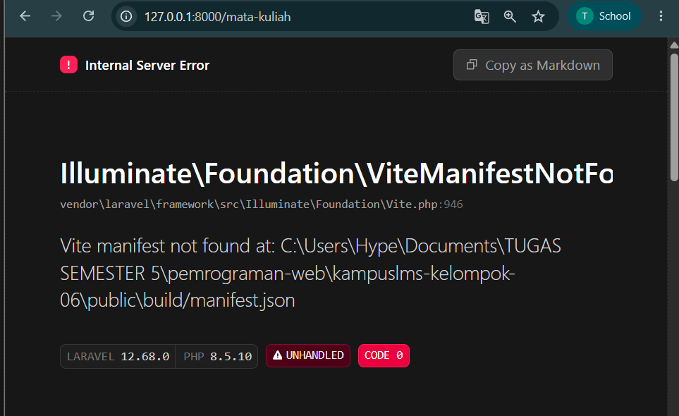
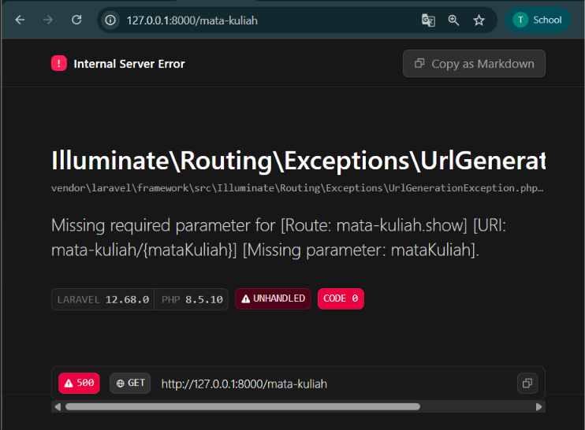

### Nama : Tika Mila Wahyuni
### NIM : 10241070

# READ
Ambil route `/tentang`
### 1. Baris mana di `routes/web.php` yang menangkapnya?

Jawaban:

Route yang menangkap tentang ada di routes/web.php
``` php 
// Route untuk halaman Tentang.
Route::get('/tentang', function () {
    return view('tentang');
})->name('tentang');
```

### 2. Kalau ditangani controller, berkas dan method mana?

Jawaban:

Route `/tentang` tidak menggunakan controller karena langsung mengarah ke view.

### 3. View mana yang dikembalikan? Di path apa persisnya?

Jawaban:

view yang dikembalikan adalah `/tentang`. File lengkapnya berada di `resources/views/tentang.blade.php`

### 4. Layout apa yang membungkusnya?

Jawaban:
Halaman `/tentang` tidak menggunakan `x-layout`. File `tentang.blade.php` merupakan halaman mandiri yang memiliki struktur HTML sendiri.

### 5. Jalankan `php artisan route:list --path=tentang`. Cocok dengan analisis Anda?

Jawaban:

Hasil `php artisan route:list --path=tentang` menunjukkan bahwa route `/tentang` terdaftar dan menggunakan method GET. Hasil tersebut sesuai dengan analisis.




#  BREAK

| # | Yang dirusak | Prediksi Sebelum Menjalankan | Yang ada Pelajari | Error |
|---|--------------|-------------------------------|------------------------|-------|
| 1 | Ubah `Route::get` menjadi `Route::post` pada route daftar mata kuliah |Terjadi error karena method yang digunakan tidak sesuai|Method HTTP tidak cocok (405)| Muncul error karena browser mengirim request `GET`, sedangkan route hanya menerima `POST`|
| 2 | Ubah nama view di `return view(...)` menjadi yang tidak ada |Terjadi error karena nama view yang dipanggil tidak sesuai dengan file yang tersedia.|Exception view not found| Nama view di `CourseController` diubah dari `courses.index` menjadi `courses.indexx` akibatnya laravel tidak menemukan file view yang sesuai|
| 3 | Hapus `->name('courses.show')`, lalu muat halaman yang memakai `route('courses.show')` |Kemungkinan terjadi error karena halaman menggunakan nama route yang sudah dihapus.|Kenapa nama route wajib| Nama route `mata-kuliah.show` dihapus sehingga tombol Lihat Detail menampilkan error karena route tidak ditemukan|
| 4 | Pindahkan `/courses/{course}` ke ATAS `/courses/create`, lalu buka `/courses/create` |Halaman tidak tampil karena urutan route salah|Urutan route menentukan|Route `/mata-kuliah/{mataKuliah}` diletakkan sebelum `/mata-kuliah/create` sehingga `create` dianggap sebagai ID dan menyebabkan error karena data tidak ditemukan|
| 5 | Ganti `{{ $nama }}` menjadi `{!! $nama !!}`, isi `$nama` dengan `<script>alert('XSS')</script>` |Muncul peringatan|**XSS nyata di layar Anda sendiri** | `{{ }}` menampilkan teks dengan aman sehingga script tidak dijalankan, sedangkan `{!! !!}` menampilkan isi apa adanya sehingga HTML/JavaScript dapat dijalankan dan menyebabkan XSS|
| 6 | Hapus `@vite(...)` dari layout |Tidak muncul desai UI nya karena CSS/JavaScript tidak ada|Aset tidak termuat | `@vite` dihapus sehingga file CSS tidak terbaca dan tampilan halaman menjadi polos tidak ada UI nya|
| 7 | Hentikan `npm run dev` lalu muat ulang halaman |Aplikasi dengan tampilan UI tidak bisa dibuka|Beda dev server vs build | `npm run dev` dihentikan sehingga Laravel tidak dapat menemukan asset Vite dan muncul error|
| 8 | Panggil `route('courses.show')` tanpa mengirim parameter |Aplikasi akan error karena tidak diberikan parameter|Missing required parameter | Parameter ID pada route `mata-kuliah.show` dihapus sehingga muncul error karena parameter `{mataKuliah}` wajib diisi|

# FIX

1. Mengembalikan method route `/mata-kuliah` dari `POST` menjadi `GET` agar halaman dapat dibuka melalui browser.
   
2. Mengembalikan nama view dari `courses.indexx` menjadi `courses.index` agar Laravel dapat menemukan file view yang benar.
   
3. Menambahkan kembali nama route  `mata-kuliah.show` agar fungsi `route()` dapat menemukan route tersebut.
   
4. Memindahkan route `/mata-kuliah/create` sebelum `route /mata-kuliah/{mataKuliah}` agar `create` tidak dianggap sebagai ID mata kuliah.
   
5. Mengembalikan `{!! !!}` menjadi `{{ }}` agar kode HTML atau JavaScript dari data tidak dijalankan dan lebih aman dari XSS.
   
6. Menambahkan kembali `@vite` agar file CSS dan JavaScript dapat dimuat sehingga tampilan UI kembali normal.
   
7. Menjalankan kembali `npm run dev` agar Vite dapat menyediakan asset yang dibutuhkan oleh aplikasi.
   
8. Menambahkan kembali `$course['id']` pada `route('mata-kuliah.show', $course['id'])` agar URL detail memiliki parameter mata kuliah yang dibutuhkan.