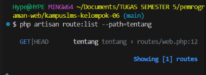
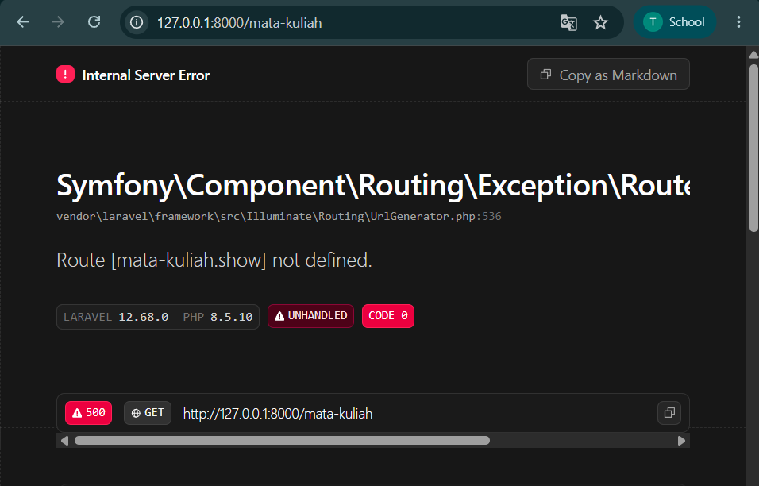
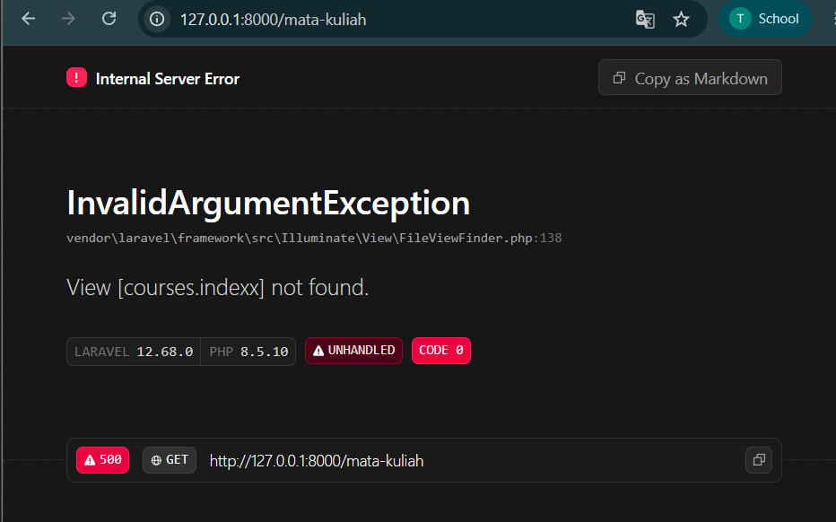
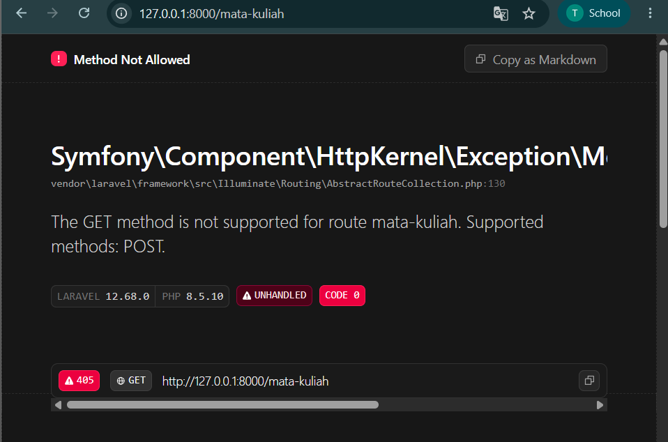
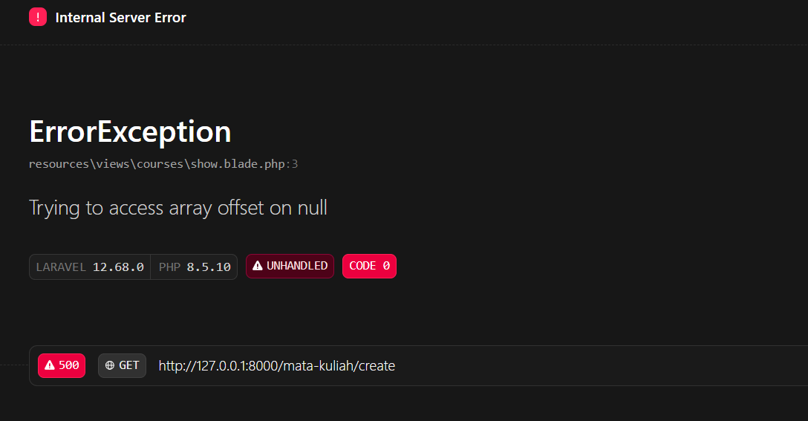
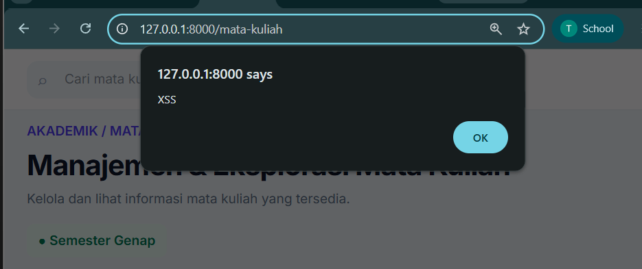
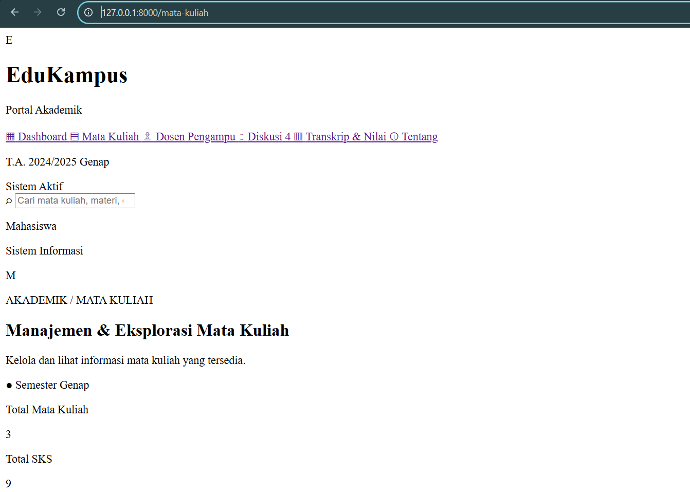
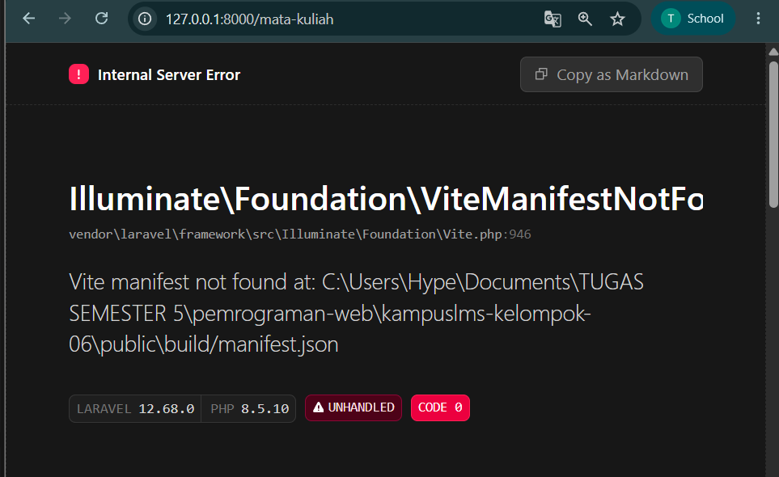
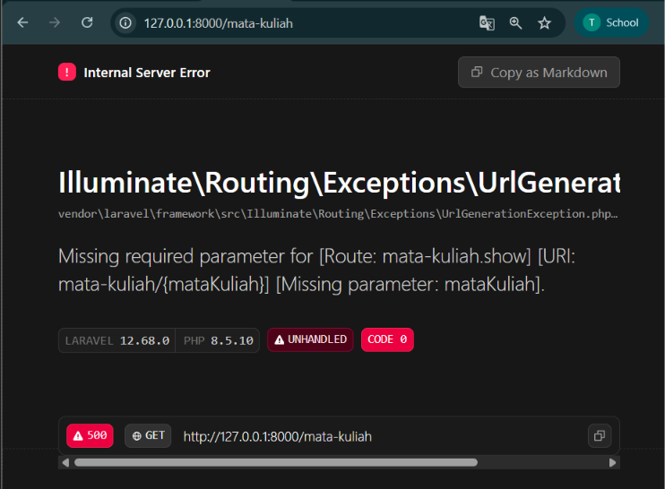

### Nama : Tika Mila Wahyuni
### NIM : 10241070

# READ
Ambil route `/tentang`
### 1. Baris mana di `routes/web.php` yang menangkapnya?

Jawaban:

Route yang menangkap tentang ada di routes/web.php
``` php 
// Route untuk halaman Tentang.
Route::get('/tentang', function () {
    return view('tentang');
})->name('tentang');
```

### 2. Kalau ditangani controller, berkas dan method mana?

Jawaban:

Route `/tentang` tidak menggunakan controller karena langsung mengarah ke view.

### 3. View mana yang dikembalikan? Di path apa persisnya?

Jawaban:

view yang dikembalikan adalah `/tentang`. File lengkapnya berada di `resources/views/tentang.blade.php`

### 4. Layout apa yang membungkusnya?

Jawaban:
Halaman `/tentang` tidak menggunakan `x-layout`. File `tentang.blade.php` merupakan halaman mandiri yang memiliki struktur HTML sendiri.

### 5. Jalankan `php artisan route:list --path=tentang`. Cocok dengan analisis Anda?

Jawaban:

Hasil `php artisan route:list --path=tentang` menunjukkan bahwa route `/tentang` terdaftar dan menggunakan method GET. Hasil tersebut sesuai dengan analisis.




#  BREAK

| # | Yang dirusak | Prediksi Sebelum Menjalankan | Yang ada Pelajari | Error |
|---|--------------|-------------------------------|------------------------|-------|
| 1 | Ubah `Route::get` menjadi `Route::post` pada route daftar mata kuliah |Terjadi error karena method yang digunakan tidak sesuai|Method HTTP tidak cocok (405)| Muncul error karena browser mengirim request `GET`, sedangkan route hanya menerima `POST`|
| 2 | Ubah nama view di `return view(...)` menjadi yang tidak ada |Terjadi error karena nama view yang dipanggil tidak sesuai dengan file yang tersedia.|Exception view not found| Nama view di `CourseController` diubah dari `courses.index` menjadi `courses.indexx` akibatnya laravel tidak menemukan file view yang sesuai|
| 3 | Hapus `->name('courses.show')`, lalu muat halaman yang memakai `route('courses.show')` |Kemungkinan terjadi error karena halaman menggunakan nama route yang sudah dihapus.|Kenapa nama route wajib| Nama route `mata-kuliah.show` dihapus sehingga tombol Lihat Detail menampilkan error karena route tidak ditemukan|
| 4 | Pindahkan `/courses/{course}` ke ATAS `/courses/create`, lalu buka `/courses/create` |Halaman tidak tampil karena urutan route salah|Urutan route menentukan|Route `/mata-kuliah/{mataKuliah}` diletakkan sebelum `/mata-kuliah/create` sehingga `create` dianggap sebagai ID dan menyebabkan error karena data tidak ditemukan|
| 5 | Ganti `{{ $nama }}` menjadi `{!! $nama !!}`, isi `$nama` dengan `<script>alert('XSS')</script>` |Muncul peringatan|**XSS nyata di layar Anda sendiri** | `{{ }}` menampilkan teks dengan aman sehingga script tidak dijalankan, sedangkan `{!! !!}` menampilkan isi apa adanya sehingga HTML/JavaScript dapat dijalankan dan menyebabkan XSS|
| 6 | Hapus `@vite(...)` dari layout |Tidak muncul desai UI nya karena CSS/JavaScript tidak ada|Aset tidak termuat | `@vite` dihapus sehingga file CSS tidak terbaca dan tampilan halaman menjadi polos tidak ada UI nya|
| 7 | Hentikan `npm run dev` lalu muat ulang halaman |Aplikasi dengan tampilan UI tidak bisa dibuka|Beda dev server vs build | `npm run dev` dihentikan sehingga Laravel tidak dapat menemukan asset Vite dan muncul error|
| 8 | Panggil `route('courses.show')` tanpa mengirim parameter |Aplikasi akan error karena tidak diberikan parameter|Missing required parameter | Parameter ID pada route `mata-kuliah.show` dihapus sehingga muncul error karena parameter `{mataKuliah}` wajib diisi|

# FIX

1. Mengembalikan method route `/mata-kuliah` dari `POST` menjadi `GET` agar halaman dapat dibuka melalui browser.
   
2. Mengembalikan nama view dari `courses.indexx` menjadi `courses.index` agar Laravel dapat menemukan file view yang benar.
   
3. Menambahkan kembali nama route  `mata-kuliah.show` agar fungsi `route()` dapat menemukan route tersebut.
   
4. Memindahkan route `/mata-kuliah/create` sebelum `route /mata-kuliah/{mataKuliah}` agar `create` tidak dianggap sebagai ID mata kuliah.
   
5. Mengembalikan `{!! !!}` menjadi `{{ }}` agar kode HTML atau JavaScript dari data tidak dijalankan dan lebih aman dari XSS.
   
6. Menambahkan kembali `@vite` agar file CSS dan JavaScript dapat dimuat sehingga tampilan UI kembali normal.
   
7. Menjalankan kembali `npm run dev` agar Vite dapat menyediakan asset yang dibutuhkan oleh aplikasi.
   
8. Menambahkan kembali `$course['id']` pada `route('mata-kuliah.show', $course['id'])` agar URL detail memiliki parameter mata kuliah yang dibutuhkan.


# FIX - w02


### 1. Route Saling Menutupi (Route Shadowing / Route Ordering)
- **Lokasi Berkas:** `routes/web.php`
- **Kode Semula:**
  ```php
  Route::get('/courses/{course}',  [CourseController::class, 'show'])->name('courses.show');
  Route::get('/courses/create',    [CourseController::class, 'create'])->name('courses.create');
  ```
- **Deskripsi Masalah:**
  Route dengan wildcard parameter dinamis (`/courses/{course}`) didefinisikan sebelum route statis (`/courses/create`).
- **Risiko Nyata:**
  Laravel mengevaluasi route dari urutan paling atas. Ketika pengguna mengakses `/courses/create`, segmen URL `"create"` dianggap sebagai nilai dari parameter `{course}`. Request salah diarahkan ke method `CourseController@show('create')`. Karena `'create'` bukan ID numerik valid, PHP melempar `TypeError: Argument #1 ($course) must be of type int, string given` atau halaman menghasilkan 404, sehingga fitur pembuatan mata kuliah sama sekali tidak dapat diakses (*broken feature*).
- **Solusi:**
  Pindahkan route statis `/courses/create` sebelum route dinamis `/courses/{course}`:
  ```php
  Route::get('/courses/create',    [CourseController::class, 'create'])->name('courses.create');
  Route::get('/courses/{course}',  [CourseController::class, 'show'])->name('courses.show');
  ```

---

### 2. Method HTTP Salah (Wrong HTTP Method)
- **Lokasi Berkas:** `routes/web.php`
- **Kode Semula:**
  ```php
  Route::post('/courses', [CourseController::class, 'index'])->name('courses.index');
  ```
- **Deskripsi Masalah:**
  Route halaman daftar mata kuliah didaftarkan menggunakan method HTTP `POST`, padahal halaman ini hanya membaca/menampilkan data.
- **Risiko Nyata:**
  Browser standar selalu mengirimkan request HTTP `GET` ketika pengguna mengetik URL di address bar atau mengklik tautan `<a>`. Karena route hanya menerima `POST`, server menolak request dengan status **`HTTP 405 Method Not Allowed`**. Akibatnya, seluruh pengguna dan mesin pencari (crawlers) gagal membuka halaman utama daftar mata kuliah.
- **Solusi:**
  Ubah method HTTP menjadi `Route::get`:
  ```php
  Route::get('/courses', [CourseController::class, 'index'])->name('courses.index');
  ```

---

### 3. URL Hardcode pada Index View
- **Lokasi Berkas:** `resources/views/courses/index.blade.php`
- **Kode Semula:**
  ```blade
  <a href="/courses/{{ $course['id'] }}" class="btn btn-primary" style="margin-top:.75rem;">
      Lihat Detail
  </a>
  ```
- **Deskripsi Masalah:**
  Tautan menuju halaman detail mata kuliah ditulis secara manual (*hardcoded string*) `/courses/...`.
- **Risiko Nyata:**
  Menyebabkan *tight coupling* antara view dan path URI. Apabila tim pengembang di kemudian hari mengubah struktur URL (misalnya menjadi `/mata-kuliah/{course}`, mengubah prefix lokalisasi `/id/courses/...`, atau menjalankan aplikasi di dalam subdirektori web server), semua link hardcode akan patah (*broken links*) dan menghasilkan error `404 Not Found`.
- **Solusi:**
  Gunakan route helper bawaan Laravel:
  ```blade
  <a href="{{ route('courses.show', $course['id']) }}" class="btn btn-primary" style="margin-top:.75rem;">
      Lihat Detail
  </a>
  ```

---

### 4. URL Hardcode pada Show View dan Layout Navbar
- **Lokasi Berkas:**
  - `resources/views/courses/show.blade.php`: tombol kembali `<a href="/courses">`
  - `resources/views/layouts/app.blade.php`: menu navigasi `<a href="/courses">` dan `<a href="/courses/create">`
- **Deskripsi Masalah:**
  Tautan navigasi navbar dan tombol kembali masih memakai URL statis hardcode alih-alih memanfaatkan *named routes*.
- **Risiko Nyata:**
  Kerusakan navigasi global pada seluruh halaman aplikasi jika konfigurasi domain, path prefix, atau routing diperbarui. Pengembang harus mencari dan mengubah string manual di banyak file Blade secara berulang (*high maintenance overhead* dan rawan kelalaian).
- **Solusi:**
  - Di `resources/views/courses/show.blade.php`:
    ```blade
    <a href="{{ route('courses.index') }}" style="color:#4f46e5;">← Kembali ke Daftar</a>
    ```
  - Di `resources/views/layouts/app.blade.php`:
    ```blade
    <a href="{{ route('courses.index') }}">📚 Mata Kuliah</a>
    <a href="{{ route('courses.create') }}">➕ Tambah MK</a>
    ```

---

### 5. Celah Keamanan XSS (Cross-Site Scripting)
- **Lokasi Berkas:**
  - `resources/views/courses/show.blade.php` (sintaks render `{!! !!}`)
  - `app/Http/Controllers/CourseController.php` (dummy data payload)
- **Kode Semula:**
  ```blade
  <h1>{!! $course['nama'] !!}</h1>
  ```
  ```php
  'nama' => "Algoritma & Struktur Data <script>alert('⚠️ XSS! Data dari DB bisa mencuri sesi Anda!')</script>",
  ```
- **Deskripsi Masalah:**
  View menggunakan sintaks unescaped raw Blade `{!! !!}` untuk mencetak data string nama mata kuliah yang disusupi script berbahaya.
- **Risiko Nyata:**
  Celah keamanan kritis **Stored XSS**. Skrip JavaScript penyerang akan dieksekusi secara otomatis di browser setiap pengguna yang membuka halaman tersebut. Dampaknya meliputi:
  1. **Pencurian Sesi (Session Hijacking):** Penyerang dapat membaca token autentikasi.
  2. **Pencurian Akun & Akses Ilegal:** Penyerang dapat melakukan request atas nama pengguna yang sedang login (termasuk admin).
  3. **Defacement atau Pengalihan Phishing:** Halaman dapat dimanipulasi untuk mengelabui pengguna.
- **Solusi:**
  - Gunakan auto-escaping Blade `{{ ... }}` yang secara otomatis memanggil `htmlspecialchars`:
    ```blade
    <h1>{{ $course['nama'] }}</h1>
    ```
  - Bersihkan string payload pengujian pada `CourseController.php`:
    ```php
    'nama' => 'Algoritma & Struktur Data',
    ```

---

### 6. Logika Query / Filter di Dalam View (Pelanggaran Prinsip MVC)
- **Lokasi Berkas:**
  - `app/Http/Controllers/CourseController.php` (method `show()`)
  - `resources/views/courses/show.blade.php` (blok `@php ... @endphp`)
- **Kode Semula:**
  - Pada Controller:
    ```php
    public function show(int $course) {
        return view('courses.show', [
            'courses'  => $this->courses, // Kirim semua data
            'courseId' => $course,
        ]);
    }
    ```
  - Pada View:
    ```blade
    @php
        $course = null;
        foreach ($courses as $c) {
            if ($c['id'] == $courseId) {
                $course = $c;
                break;
            }
        }
    @endphp
    @if ($course === null)
        <div>❌ Mata kuliah tidak ditemukan.</div>
    ...
    ```
- **Deskripsi Masalah:**
  Controller melempar seluruh koleksi data ke view, lalu view melakukan iterasi `foreach` untuk menyaring (*query/filter*) data yang sesuai dengan ID.
- **Risiko Nyata:**
  1. **Pelanggaran Prinsip MVC (Separation of Concerns):** View bertugas murni untuk penyajian antarmuka (UI). Logika pencarian data, validasi, dan penanganan error adalah tanggung jawab Controller/Model.
  2. **Kebocoran Data & Pemborosan Memori:** Seluruh data mata kuliah dimuat ke view padahal yang diminta hanya satu. Pada aplikasi nyata berbasis database, ini sama dengan melakukan `SELECT * FROM courses` ke memori alih-alih `WHERE id = ?`.
  3. **HTTP Status Code yang Salah:** Ketika ID tidak ditemukan, view hanya menampilkan teks peringatan biasa dengan status `HTTP 200 OK`. Padahal standar RESTful web API mewajibkan status `HTTP 404 Not Found` agar perayap search engine (SEO) dan klien API mengenali bahwa resource memang tidak ada.
  4. **Kode Sulit Diuji (Untestable):** Controller test tidak dapat memverifikasi apakah logika query berhasil atau gagal karena logikanya terselubung di dalam file template Blade.
- **Solusi:**
  - Pindahkan logika pencarian ke `CourseController@show` dan panggil `abort(404)` jika tidak ditemukan:
    ```php
    public function show(int $course)
    {
        $found = collect($this->courses)->firstWhere('id', $course);

        if (! $found) {
            abort(404, 'Mata kuliah tidak ditemukan.');
        }

        return view('courses.show', ['course' => $found]);
    }
    ```
  - Hapus blok `@php ... @endphp` dan kondisi pengecekan null dari `resources/views/courses/show.blade.php`, serta langsung gunakan `$course`:
    ```blade
    @section('title', 'Detail: ' . $course['nama'])

    @section('content')
        <a href="{{ route('courses.index') }}" style="color:#4f46e5;">← Kembali ke Daftar</a>
        <div class="card" style="margin-top:1rem;">
            <h1>{{ $course['nama'] }}</h1>
            ...
        </div>
    @endsection
    ```

---

## Verifikasi Pengujian

| No | Pengujian | Target URL | Expected Result | Status |
|---|---|---|---|---|
| 1 | Akses Halaman Daftar MK | `GET /courses` | HTTP 200, Menampilkan daftar 3 mata kuliah | PASSED |
| 2 | Akses Form Tambah MK | `GET /courses/create` | HTTP 200, Halaman form tambah MK (tidak tertimpa `{course}`) | PASSED |
| 3 | Akses Detail MK Valid | `GET /courses/1` | HTTP 200, Menampilkan detail Pemrograman Web | PASSED |
| 4 | Akses Detail MK Non-Existent | `GET /courses/999` | HTTP 404 Not Found | PASSED |
| 5 | Uji Kerentanan XSS | `GET /courses/3` | Karakter HTML/script ter-escape aman atau dummy clean | PASSED |
| 6 | Pemeriksaan Route Helpers | Navbar & tombol detail | Semua URL dihasilkan secara dinamis via `route()` | PASSED |
