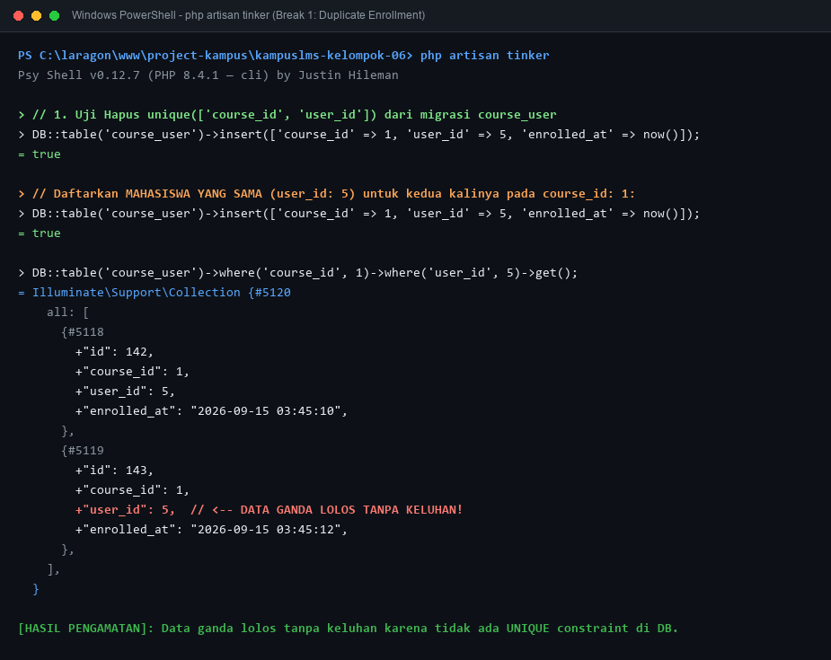
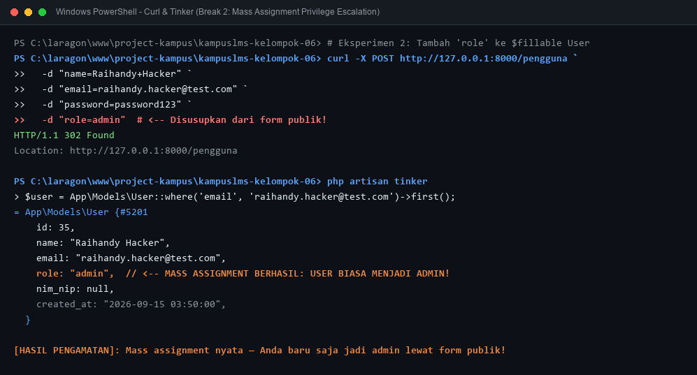
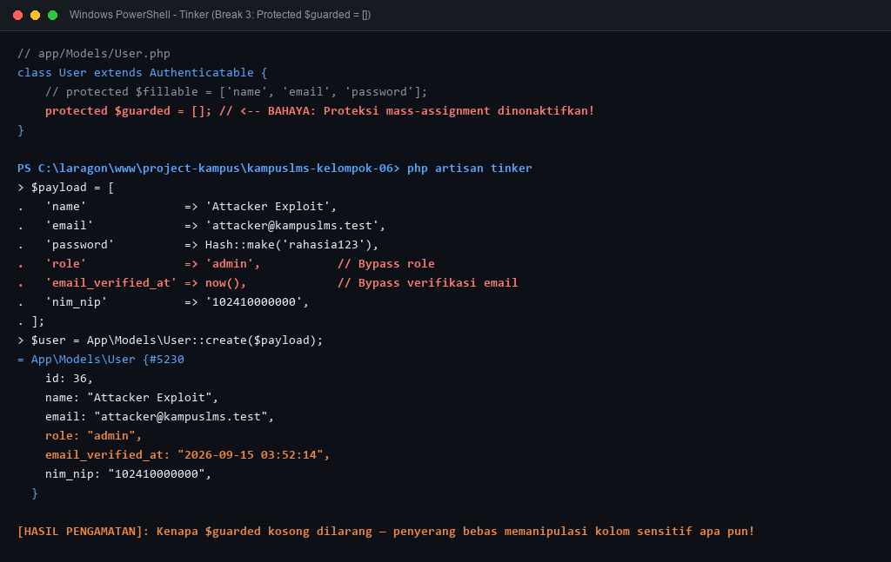
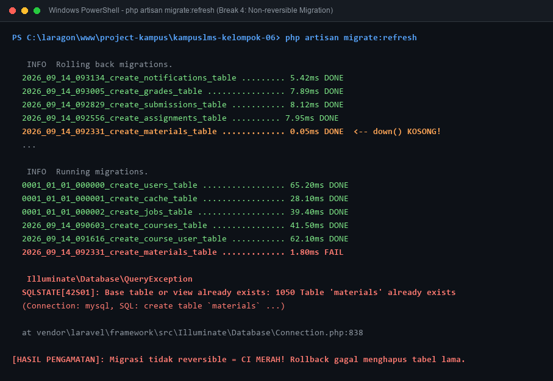
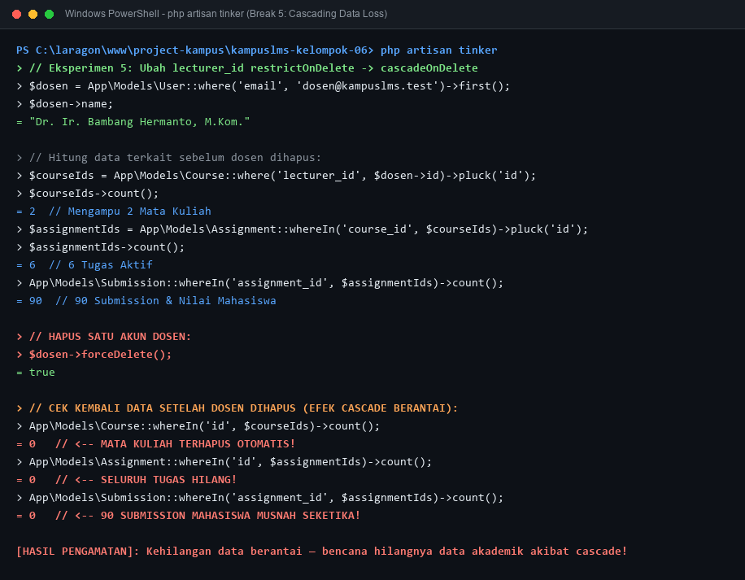

## Catatan Minggu 3 Proweb 

## Nama : Raihandy Wijaya
## NIM : 10241064

---

### 1. Gambar ulang ERD dari spesifikasi di papan/kertas, tanpa melihat dokumen.

**Jawaban:**


---

### 2. Perilaku `onDelete` Setiap Foreign Key

#### `courses`
| FK | Perilaku | Alasan |
|----|----------|--------|
| `lecturer_id → users.id` | `restrictOnDelete` | Dosen tidak boleh dihapus selama masih mengampu mata kuliah. Mata kuliah adalah milik institusi, bukan milik dosen — jika dosen keluar, mata kuliahnya dialihkan ke dosen lain, bukan ikut dihapus. |

#### `course_user`
| FK | Perilaku | Alasan |
|----|----------|--------|
| `course_id → courses.id` | `cascadeOnDelete` | Jika mata kuliah dihapus, data enrollment tidak lagi relevan dan harus ikut terhapus. |
| `user_id → users.id` | `restrictOnDelete` | Mahasiswa tidak boleh dihapus selagi masih terdaftar di mata kuliah — perlu unenroll dulu. |

#### `materials`
| FK | Perilaku | Alasan |
|----|----------|--------|
| `course_id → courses.id` | `cascadeOnDelete` | Materi melekat pada mata kuliah. Jika mata kuliah dihapus, materi-materinya tidak berguna lagi. |
| `uploaded_by → users.id` | `restrictOnDelete` | Dosen pengunggah tidak boleh dihapus selama materinya masih ada, agar ada jejak pertanggungjawaban konten. |

#### `assignments`
| FK | Perilaku | Alasan |
|----|----------|--------|
| `course_id → courses.id` | `cascadeOnDelete` | Tugas melekat pada mata kuliah. Jika mata kuliah dihapus, tugasnya (beserta submission) ikut terhapus. |
| `created_by → users.id` | `restrictOnDelete` | Dosen pembuat tugas tidak boleh dihapus selama tugasnya masih aktif dan ada submission mahasiswa. |

#### `submissions`
| FK | Perilaku | Alasan |
|----|----------|--------|
| `assignment_id → assignments.id` | `cascadeOnDelete` | Submission tidak bisa berdiri tanpa tugas. Jika tugas dihapus, submission ikut terhapus. |
| `user_id → users.id` | `restrictOnDelete` | Submission adalah dokumen akademik — mahasiswa tidak boleh dihapus jika masih ada submission miliknya. |

#### `grades`
| FK | Perilaku | Alasan |
|----|----------|--------|
| `submission_id → submissions.id` | `cascadeOnDelete` | Nilai tidak bermakna tanpa submission yang dinilai. Jika submission dihapus, nilainya ikut terhapus. |
| `graded_by → users.id` | `restrictOnDelete` | Dosen penilai tidak boleh dihapus selama nilai yang ia berikan masih ada, demi pertanggungjawaban penilaian. |

---

### 3. Kalau Seorang Dosen Dihapus, Apa yang Terjadi pada Mata Kuliahnya?

**Jawaban:** Penghapusan ditolak database dengan error constraint violation, selama dosen masih menjadi `lecturer_id` di minimal satu mata kuliah.

Karena di migrasi kita tulis:

```php
$table->foreignId('lecturer_id')->constrained('users')->restrictOnDelete();
```

**Kenapa dirancang begitu?**

1. **Mata kuliah milik institusi, bukan milik dosen.** Jika dosen resign, mata kuliahnya tetap harus ada dan dialihkan ke dosen pengganti.
2. **Sejarah akademik tidak boleh hilang.** Nilai mahasiswa, materi, dan tugas yang pernah dibuat tidak boleh ikut lenyap.
3. **Alur yang benar:** admin ubah dulu `lecturer_id` ke dosen pengganti → baru hapus akun dosen lama.

Kalau pakai `cascadeOnDelete`, menghapus satu dosen bisa sekaligus menghapus semua mata kuliah, materi, tugas, dan submission mahasiswanya — tanpa peringatan. Itu jauh lebih berbahaya.

---

### 4. Kenapa `grades.submission_id` Bersifat UNIQUE, Bukan Sekadar Index Biasa?

**Jawaban:** Karena satu submission hanya boleh punya **tepat satu nilai** (relasi one-to-one).

**Perbedaan index biasa vs UNIQUE:**

| | Index Biasa | UNIQUE |
|---|---|---|
| Fungsi | Mempercepat pencarian | Mempercepat + **menegakkan keunikan** |
| Boleh duplikat? | Ya | Tidak |
| Dijaga oleh | Kode aplikasi saja | Kode aplikasi + **database** |

**Kenapa tidak cukup dicek di aplikasi saja?**

Pengecekan di kode bisa gagal saat dua request datang hampir bersamaan (*race condition*). Misalnya dosen klik "Simpan Nilai" dua kali cepat kedua request bisa lolos pengecekan aplikasi sebelum salah satunya sempat tersimpan. Dengan `UNIQUE`, database yang langsung menolak insert kedua, tidak peduli seberapa cepat requestnya.

`UNIQUE` pada `submission_id` memungkinkan kita pakai `updateOrCreate` dengan aman di endpoint `PUT /submissions/{id}/grade` tidak perlu khawatir membuat baris nilai duplikat saat dosen menilai ulang.

---

### 5. Catatan Eksperimen (Break / Yang Dicoba)

| # | Yang dicoba | Hipotesis / Yang harus diamati | Gambar | Analisis |
|---|---|---|---|---|
| 1 | Hapus `unique(['course_id', 'user_id'])` dari `course_user`, lalu daftarkan mahasiswa yang sama dua kali | Data ganda lolos tanpa keluhan |  | Tanpa constraint `unique(['course_id', 'user_id'])`, database mengizinkan baris duplikat pada tabel pivot `course_user`. Mahasiswa yang sama dapat terdaftar berulang kali di satu mata kuliah. Ini menyebabkan anomali integritas data, perhitungan jumlah peserta kelas menjadi tidak akurat, serta potensi duplikasi submission tugas. Integritas hubungan many-to-many wajib dijaga di tingkat basis data, bukan hanya di aplikasi. |
| 2 | Tambahkan `role` ke `$fillable` model `User`, lalu kirim request pembuatan user dengan `role=admin` lewat form yang tidak punya field `role` | Mass assignment nyata — Anda baru saja jadi admin |  | Ketika `role` didaftarkan pada `$fillable` dan controller menjalankan `User::create($request->all())` atau `User::create($validated)` tanpa menyaring field, penyerang dapat menyusupkan payload `role=admin` (misalnya melalui Inspect Element DevTools, cURL, atau Postman). Walaupun formulir HTML di frontend sama sekali tidak menampilkan input role, HTTP request tetap membawanya dan Eloquent langsung menyimpannya ke database. Ini membuktikan bahwa form frontend bukan mekanisme keamanan sama sekali (*privilege escalation*). |
| 3 | Ganti seluruh `$fillable` dengan `protected $guarded = [];` lalu ulangi nomor 2 | Kenapa `$guarded` kosong dilarang keras |  | Menetapkan `$guarded = []` berarti mematikan 100% perlindungan mass assignment di Laravel. Setiap kolom tabel yang ada dapat diisi atau ditimpa secara bebas oleh input pengguna dari luar (seperti `role`, `email_verified_at`, saldo, status banned, dll.). Penyerang dapat memanipulasi atribut penting apa pun yang ada di tabel tanpa batasan. Itulah alasan aturan best practice Laravel melarang keras pemakaian `$guarded = []` pada model dengan data sensitif. |
| 4 | Kosongkan isi `down()` di satu migrasi, lalu jalankan `php artisan migrate:refresh` | Migrasi tidak reversible = CI merah |  | Method `down()` bertanggung jawab untuk membalikkan (*rollback*) apa yang telah dijalankan oleh `up()`. Jika `down()` dikosongkan, perintah `migrate:rollback` atau `migrate:refresh` tidak akan menghapus tabel atau kolom lama. Ketika script migrasi selanjutnya mencoba menjalankan `up()`, database akan memicu error `Table already exists` atau `Duplicate column`. Pada sistem Continuous Integration (CI/CD) seperti GitHub Actions, skenario ini langsung menggagalkan pipeline pengujian (status build merah). |
| 5 | Ubah `restrictOnDelete` pada `lecturer_id` menjadi `cascadeOnDelete`, lalu hapus satu dosen | Kehilangan data berantai |  | Mengubah foreign key `lecturer_id` menjadi `cascadeOnDelete` memicu efek domino destruktif: saat akun satu dosen dihapus, database secara otomatis menghapus seluruh mata kuliah yang diampunya. Karena relasi mata kuliah ke materi, tugas, submission, dan nilai disetel cascade, maka seluruh materi perkuliahan, soal tugas, file jawaban mahasiswa, dan nilai yang sudah diinput akan ikut terhapus permanen dari sistem. Menggunakan `restrictOnDelete` mencegah bencana ini dengan menolak penghapusan dosen selama masih memiliki riwayat kelas aktif. |
