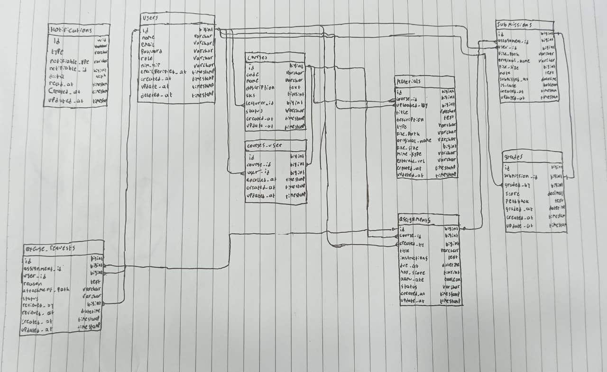

## Catatan Minggu 3 Pemrograman Web

### READ

**1. Gambar ulang ERD dari spesifikasi di papan/kertas, tanpa melihat dokumen.**

Jawaban : 

---

**2. Untuk setiap foreign key, tentukan perilaku `onDelete`-nya dan tuliskan alasannya.**

Jawaban : 
#### `courses`
| FK | Perilaku | Alasan |
|----|----------|--------|
|`lecturer_id → users.id` | `restrictOnDelete` | Dosen tidak boleh dihapus selama masih mengampu mata kuliah, karena mata kuliah itu milik institusi, bukan milik dosen. Jadi, jika dosen keluar maka mata kuliahnya dialihkan ke dosen lain, bukan ikut dihapus |

#### `course_user`
| FK | Perilaku | Alasan |
|----|----------|--------|
|`course_id → courses.id` | `cascadeOnDelete` | Kalau sebuah mata kuliah dihapus, data enrollment-nya juga ikut dihapus, karena data itu sudah tidak dibutuhkan lagi.|
|`user_id → users.id` | `restrictOnDelete` | Data mahasiswa tidak boleh dihapus selama mahasiswa itu masih terdaftar di suatu mata kuliah. Mahasiswa harus di-unenroll dulu dari semua mata kuliahnya, baru datanya boleh dihapus. |

#### `materials`
| FK | Perilaku | Alasan |
|----|----------|--------|
|`course_id → courses.id` | `cascadeOnDelete` | Materi adalah bagian dari sebuah mata kuliah. Kalau mata kuliahnya dihapus, semua materinya juga ikut dihapus, karena materi tidak berguna tanpa mata kuliahnya. |
|`uploaded_by → users.id` | `restrictOnDelete` | Data dosen tidak boleh dihapus selama masih ada materi yang diunggah oleh dosen tersebut. Hal ini supaya selalu jelas siapa yang bertanggung jawab atas isi materi itu. |

#### `assignments`
| FK | Perilaku | Alasan |
|----|----------|--------|
|`course_id → courses.id` | `cascadeOnDelete` | Tugas adalah bagian dari sebuah mata kuliah. Kalau mata kuliahnya dihapus, semua tugasnya ikut dihapus, termasuk jawaban atau pengumpulan (submission) dari mahasiswa. |
|`created_by → users.id` | `restrictOnDelete` | Data dosen tidak boleh dihapus selama tugas yang dibuatnya masih aktif dan sudah ada submission dari mahasiswa. Dosen baru boleh dihapus setelah tugasnya tidak aktif lagi atau belum ada yang mengumpulkan. |

#### `submissions`
| FK | Perilaku | Alasan |
|----|----------|--------|
|`assignment_id → assignments.id` | `cascadeOnDelete` | Submission tidak bisa ada tanpa tugasnya. Kalau sebuah tugas dihapus, semua submission yang terkait dengan tugas itu juga ikut dihapus. |
|`user_id → users.id` | `restrictOnDelete` | Submission adalah dokumen akademik, jadi data mahasiswa tidak boleh dihapus selama masih ada submission miliknya. |

#### `grades`
| FK | Perilaku | Alasan |
|----|----------|--------|
|`submission_id → submissions.id` | `cascadeOnDelete` | Nilai hanya punya arti jika ada submission yang dinilai. Kalau sebuah submission dihapus, nilainya juga ikut dihapus. |
|`graded_by → users.id` | `restrictOnDelete` | Data dosen tidak boleh dihapus selama masih ada nilai yang diberikannya. Hal ini supaya selalu jelas siapa yang bertanggung jawab atas penilaian tersebut. |

---

**3. Kalau seorang Dosen dihapus, apa yang terjadi pada Mata Kuliahnya?**

Jawaban : Dosen tidak bisa dihapus selama masih menjadi dosen pengampu (`lecturer_id`) di minimal satu mata kuliah. Kalau dicoba, database akan menolaknya dengan error *constraint violation*.

Ini karena di migrasi kita menulis:

```php
$table->foreignId('lecturer_id')->constrained('users')->restrictOnDelete();
```

**Kenapa dibuat begitu?**

1. **Mata kuliah milik institusi, bukan milik dosen.** Kalau dosen resign, mata kuliahnya tetap ada dan dipindahkan ke dosen pengganti.
2. **Sejarah akademik tidak boleh hilang.** Nilai mahasiswa, materi, dan tugas yang sudah dibuat tidak boleh ikut terhapus.
3. **Urutan yang benar:** admin mengganti `lecturer_id` ke dosen pengganti dulu, baru akun dosen lama dihapus.

Kalau memakai `cascadeOnDelete`, menghapus satu dosen bisa langsung menghapus semua mata kuliah, materi, tugas, dan submission miliknya tanpa peringatan. Itu jauh lebih berbahaya.

---

**4. Kenapa `grades.submission_id`bersifat UNIQUE, bukan sekedar Index biasa?**

Jawaban : Karena satu submission hanya boleh punya tepat satu nilai (relasi one-to-one).

**Beda index biasa dan UNIQUE**

| | Index biasa | UNIQUE |
|---|---|---|
| Fungsi | Mempercepat pencarian | Mempercepat pencarian dan memastikan data tidak kembar |
| Boleh duplikat? | Ya | Tidak |
| Dijaga oleh | Kode aplikasi saja | Kode aplikasi dan database |

**Kenapa tidak cukup dicek di aplikasi saja?**

Pengecekan di kode bisa gagal kalau dua request datang hampir bersamaan (*race condition*). Misalnya dosen menekan tombol "Simpan Nilai" dua kali dengan cepat. Kedua request bisa lolos pengecekan karena yang pertama belum sempat tersimpan. Dengan `UNIQUE`, database langsung menolak insert kedua, secepat apa pun requestnya.

---

### BREAK

| No. | Yang Dicoba | Yang Diperkirakan Terjadi | Penjelasan |
|---|---|---|---|
| **1** | Hapus `unique(['course_id', 'user_id'])` dari tabel `course_user`, lalu daftarkan mahasiswa yang sama ke satu mata kuliah dua kali. | Mahasiswa yang sama bisa terdaftar dua kali tanpa ada pesan error. | Tanpa aturan unik, database tidak melarang data kembar di tabel `course_user`. Akibatnya satu mahasiswa bisa tercatat dua kali di mata kuliah yang sama, sehingga jumlah peserta jadi tidak akurat. Karena itu aturan unik harus dipasang di database, bukan hanya di kode. |
| **2** | Tambahkan `role` ke `$fillable` di model `User`, lalu kirim `role=admin` lewat form yang sebenarnya tidak punya pilihan role. | User biasa bisa jadi admin hanya dengan mengirim nilai `role`. | Kolom di `$fillable` boleh diisi dari data yang dikirim user. Kalau controller memakai `$request->all()`, siapa pun bisa menambahkan `role=admin` lewat Inspect Element, cURL, atau Postman, lalu otomatis jadi admin. |
| **3** | Ganti seluruh `$fillable` dengan `protected $guarded = [];`, lalu ulangi percobaan nomor 2. | Data apa pun yang dikirim bisa masuk ke database tanpa batasan. | `$guarded = []` berarti semua kolom boleh diisi dari luar. Tidak ada lagi pembatasan, jadi user bisa mengubah kolom sensitif seperti `role` atau status akun. |
| **4** | Kosongkan isi `down()` di salah satu migration, lalu jalankan `php artisan migrate:refresh`. | `migrate:refresh` gagal. | `down()` berfungsi membatalkan apa yang dibuat oleh `up()`. Kalau kosong, saat rollback tabelnya tidak ikut dihapus. Lalu ketika migration dijalankan ulang, Laravel mencoba membuat tabel yang sudah ada dan muncul error "table already exists". |
| **5** | Ubah `restrictOnDelete` pada `lecturer_id` jadi `cascadeOnDelete`, lalu hapus salah satu dosen. | Data yang berhubungan dengan dosen ikut terhapus. | Dengan `cascadeOnDelete`, menghapus dosen akan ikut menghapus semua mata kuliahnya, dan data turunannya (materi, tugas, submission, nilai) juga bisa ikut hilang. Ini berisiko menghilangkan data penting. `restrictOnDelete` lebih aman karena dosen tidak bisa dihapus selama masih mengampu mata kuliah. |


---

### FIX

**Branch `w03` pada repo `kampuslms-broken` berisi 7 masalah: urutan migrasi salah, dua unique composite hilang, satu `onDelete` keliru, satu `$guarded = []`, satu `down()` kosong, dan satu controller yang memakai `$request->all()`.**

---

**1. Urutan migrasi salah**

- Masalah : Berkas migrasi tabel yang memiliki foreign key (misalnya `courses` atau `course_user`) memiliki timestamp lebih awal daripada tabel yang dirujuknya (`users` atau `courses`).

- Dampak : `php artisan migrate:fresh --seed` gagal dengan error foreign key (tabel yang dirujuk belum ada). Setiap anggota kelompok tidak bisa membuat database, dan CI GitHub Actions menjadi merah.

- Perbaikan : Nama berkas migrasi diubah (timestamp disesuaikan) agar tabel yang dirujuk dibuat lebih dulu, dengan urutan `users` → `courses` → `course_user`, `materials`, `assignments` → `submissions` → `grades` → `notifications`. Setelah itu `migrate:fresh --seed` berjalan tanpa error.


**2. Unique composite hilang**

2a. `unique(['course_id', 'user_id'])` pada `course_user`
- Masalah : Constraint unique pada tabel `course_user` tidak ada.

- Dampak : Mahasiswa yang sama bisa terdaftar dua kali di mata kuliah yang sama, misalnya karena klik tombol daftar dua kali dengan cepat (race condition). Jumlah peserta menjadi tidak akurat dan data yang tampil ikut ganda.

- Perbaikan : Ditambahkan `$table->unique(['course_id', 'user_id']);` pada migrasi `course_user`. Pendaftaran kedua untuk mahasiswa dan mata kuliah yang sama kini ditolak oleh database.

2b. `unique(['assignment_id', 'user_id'])` pada `submissions`
- Masalah : Constraint unique pada tabel `submissions` tidak ada.

- Dampak : Satu mahasiswa bisa memiliki dua submission untuk tugas yang sama. Dosen jadi bingung submission mana yang harus dinilai, dan nilai bisa tercatat pada data yang salah.

- Perbaikan : Ditambahkan `$table->unique(['assignment_id', 'user_id']);` pada migrasi `submissions`. Insert kedua untuk tugas dan mahasiswa yang sama kini ditolak database dengan error duplicate entry.


**3. `onDelete` keliru pada `lecturer_id`**

- Masalah : Foreign key `lecturer_id` pada tabel `courses` memakai `cascadeOnDelete()`, padahal spesifikasi menetapkan `restrictOnDelete()`.

- Dampak : Menghapus satu dosen langsung menghapus semua mata kuliahnya, lalu berantai ke materi, tugas, submission, dan nilai, tanpa peringatan. Mata kuliah adalah milik institusi dan sejarah akademik tidak boleh hilang.

- Perbaikan : Diganti menjadi `$table->foreignId('lecturer_id')->constrained('users')->restrictOnDelete();`. Setelah itu penghapusan dosen yang masih mengampu mata kuliah ditolak database dengan error constraint violation, dan admin harus mengalihkan `lecturer_id` ke dosen pengganti lebih dulu.


**4. `protected $guarded = [];` pada model**

- Masalah : Model (misalnya `User`) memakai `protected $guarded = [];` sehingga semua kolom boleh diisi dari luar.

- Dampak : Pengguna bisa menyelipkan field yang tidak ada di formulir, misalnya `role=admin`, dan menjadi admin (mass assignment). Perlindungan model mati sepenuhnya.

- Perbaikan : `$guarded` dihapus dan diganti `$fillable` yang hanya berisi kolom aman (`name`, `email`, `password`). Kolom `role` dikeluarkan dari `$fillable` dan diisi eksplisit di controller. Percobaan membuat user dengan `role=admin` lewat Tinker tidak lagi mengisi kolom `role` dari input.


**5. `down()` kosong pada satu migrasi**

- Masalah : Method `down()` pada salah satu migrasi tidak berisi apa pun, padahal `up()`-nya membuat tabel atau menambah kolom.

- Dampak : `php artisan migrate:refresh` tidak bisa membatalkan migrasi tersebut, sehingga tabel lama tetap ada dan migrasi berikutnya gagal dengan error "table already exists". CI menjadi merah.

- Perbaikan : `down()` diisi agar membalik `up()`, misalnya `Schema::dropIfExists('nama_tabel');` (atau `dropColumn` bila yang ditambahkan hanya kolom). Setelah itu `migrate:refresh` berjalan bersih.


**6. Controller memakai `$request->all()`**

- Masalah : Method `store` dan `update` memanggil `Model::create($request->all())`, yang menyimpan semua data yang dikirim pengguna.

- Dampak : Field liar yang tidak ada di formulir (misalnya `role`, `lecturer_id`, atau `status`) ikut diproses jika kolomnya ada di `$fillable`, sehingga penyerang bisa menaikkan hak akses atau mengubah data yang bukan haknya.

- Perbaikan : Diganti dengan `$request->only(['name', 'email', 'password'])` (atau field yang memang diizinkan), dan `role` diisi eksplisit di controller. Setelah minggu 4, ini diganti menjadi `$request->validated()`. Request dengan tambahan `role=admin` kini tidak mengubah role pengguna.