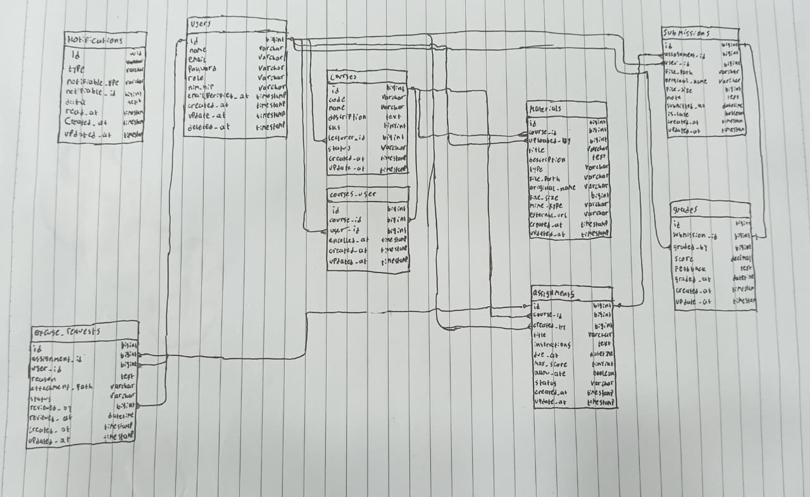

## Nama : Tika Mila Wahyuni
## NIM : 10241070

### 1. Gambar ulang ERD dari spesifikasi di papan/kertas, tanpa melihat dokumen.

Jawaban:



### 2. Perilaku `onDelete` Setiap Foreign Key

#### `courses`
| FK | Perilaku | Alasan |
|----|----------|--------|
| `lecturer_id → users.id` | `restrictOnDelete` | Dosen tidak boleh dihapus selama masih mengampu mata kuliah. Mata kuliah adalah milik institusi, bukan milik dosen — jika dosen keluar, mata kuliahnya dialihkan ke dosen lain, bukan ikut dihapus. |

#### `course_user`
| FK | Perilaku | Alasan |
|----|----------|--------|
| `course_id → courses.id` | `cascadeOnDelete` | Jika mata kuliah dihapus, data enrollment tidak lagi relevan dan harus ikut terhapus. |
| `user_id → users.id` | `restrictOnDelete` | Mahasiswa tidak boleh dihapus selagi masih terdaftar di mata kuliah — perlu unenroll dulu. |

#### `materials`
| FK | Perilaku | Alasan |
|----|----------|--------|
| `course_id → courses.id` | `cascadeOnDelete` | Materi melekat pada mata kuliah. Jika mata kuliah dihapus, materi-materinya tidak berguna lagi. |
| `uploaded_by → users.id` | `restrictOnDelete` | Dosen pengunggah tidak boleh dihapus selama materinya masih ada, agar ada jejak pertanggungjawaban konten. |

#### `assignments`
| FK | Perilaku | Alasan |
|----|----------|--------|
| `course_id → courses.id` | `cascadeOnDelete` | Tugas melekat pada mata kuliah. Jika mata kuliah dihapus, tugasnya (beserta submission) ikut terhapus. |
| `created_by → users.id` | `restrictOnDelete` | Dosen pembuat tugas tidak boleh dihapus selama tugasnya masih aktif dan ada submission mahasiswa. |

#### `submissions`
| FK | Perilaku | Alasan |
|----|----------|--------|
| `assignment_id → assignments.id` | `cascadeOnDelete` | Submission tidak bisa berdiri tanpa tugas. Jika tugas dihapus, submission ikut terhapus. |
| `user_id → users.id` | `restrictOnDelete` | Submission adalah dokumen akademik — mahasiswa tidak boleh dihapus jika masih ada submission miliknya. |

#### `grades`
| FK | Perilaku | Alasan |
|----|----------|--------|
| `submission_id → submissions.id` | `cascadeOnDelete` | Nilai tidak bermakna tanpa submission yang dinilai. Jika submission dihapus, nilainya ikut terhapus. |
| `graded_by → users.id` | `restrictOnDelete` | Dosen penilai tidak boleh dihapus selama nilai yang ia berikan masih ada, demi pertanggungjawaban penilaian. |

---

### 3. Kalau Seorang Dosen Dihapus, Apa yang Terjadi pada Mata Kuliahnya?

**Jawaban:** Penghapusan ditolak database dengan error constraint violation, selama dosen masih menjadi `lecturer_id` di minimal satu mata kuliah.

Karena di migrasi kita tulis:

```php
$table->foreignId('lecturer_id')->constrained('users')->restrictOnDelete();
```

**Kenapa dirancang begitu?**

1. **Mata kuliah milik institusi, bukan milik dosen.** Jika dosen resign, mata kuliahnya tetap harus ada dan dialihkan ke dosen pengganti.
2. **Sejarah akademik tidak boleh hilang.** Nilai mahasiswa, materi, dan tugas yang pernah dibuat tidak boleh ikut lenyap.
3. **Alur yang benar:** admin ubah dulu `lecturer_id` ke dosen pengganti → baru hapus akun dosen lama.

Kalau pakai `cascadeOnDelete`, menghapus satu dosen bisa sekaligus menghapus semua mata kuliah, materi, tugas, dan submission mahasiswanya — tanpa peringatan. Itu jauh lebih berbahaya.

---

### 4. Kenapa `grades.submission_id` Bersifat UNIQUE, Bukan Sekadar Index Biasa?

**Jawaban:** Karena satu submission hanya boleh punya **tepat satu nilai** (relasi one-to-one).

**Perbedaan index biasa vs UNIQUE:**

| | Index Biasa | UNIQUE |
|---|---|---|
| Fungsi | Mempercepat pencarian | Mempercepat + **menegakkan keunikan** |
| Boleh duplikat? | Ya | Tidak |
| Dijaga oleh | Kode aplikasi saja | Kode aplikasi + **database** |

**Kenapa tidak cukup dicek di aplikasi saja?**

Pengecekan di kode bisa gagal saat dua request datang hampir bersamaan (*race condition*). Misalnya dosen klik "Simpan Nilai" dua kali cepat kedua request bisa lolos pengecekan aplikasi sebelum salah satunya sempat tersimpan. Dengan `UNIQUE`, database yang langsung menolak insert kedua, tidak peduli seberapa cepat requestnya.

 `UNIQUE` pada `submission_id` memungkinkan kita pakai `updateOrCreate` dengan aman di endpoint `PUT /submissions/{id}/grade` tidak perlu khawatir membuat baris nilai duplikat saat dosen menilai ulang.

