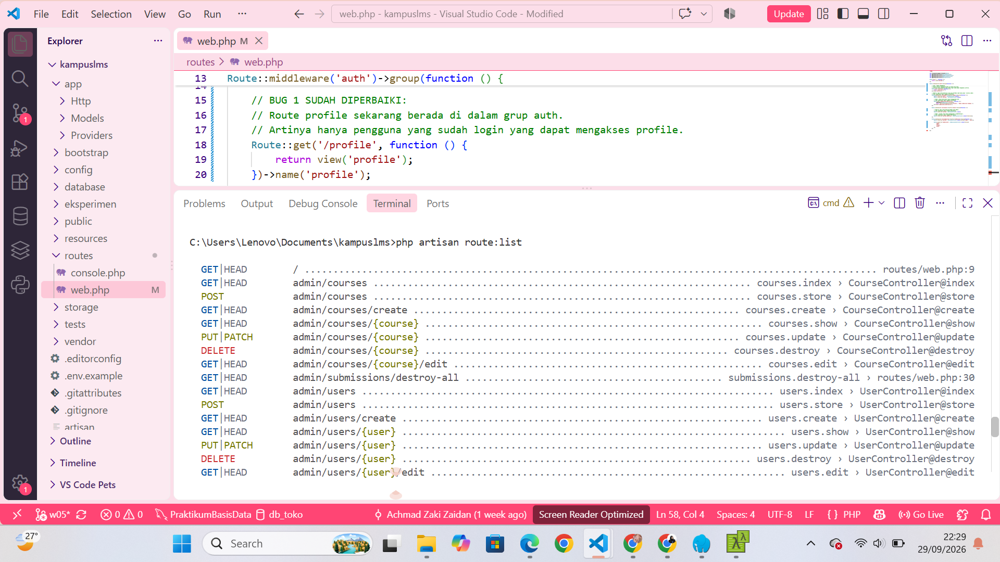

# LAPORAN MINGGU 5 — Routing Lanjutan, Model Binding, dan Middleware

**Mata Kuliah:** SI2514024 — Pemrograman Web  
**Proyek:** KampusLMS (Kelompok 06)  
**Framework:** Laravel 12  

---
## FIX — Repo cacat
Branch w05 pada repo kampuslms-broken berisi 7 masalah: satu route di luar grup auth, dua IDOR pada submission dan material, nested route tanpa scopeBindings, middleware didaftarkan di berkas yang salah, nama route bentrok antar peran, dan satu route destruktif yang memakai GET.

Perbaiki, kirim PR. Deskripsi PR wajib memuat bukti — sertakan perintah curl sebelum dan sesudah perbaikan untuk minimal satu IDOR.

### Hasil dan Pembahasan
- Route di luar grup `auth`

> Sebelumnya, halaman profile dapat diakses oleh siapa saja, termasuk pengguna yang belum login. Hal ini terjadi karena route `/profile` berada di luar middleware `auth`. Perbaikannya dilakukan dengan memindahkan route `/profile` ke dalam grup `Route::middleware('auth')`. Dengan begitu, halaman profile hanya dapat diakses oleh pengguna yang sudah login.

> Hasilnya, setelah menjalankan `php artisan route:list`, route `profile` sudah terdaftar di dalam aplikasi dan konfigurasi `auth` pada route sudah diperbaiki. Jadi, pengguna yang belum login tidak dapat langsung mengakses halaman profile.

- nested route tanpa `scopeBindings`
.png)

> Sebelumnya, route `courses.materials` belum memakai `scopeBindings()`. Akibatnya, Laravel belum memastikan bahwa material yang dibuka memang milik course tersebut.

> Perbaikannya adalah menambahkan `scopeBindings()` pada route tersebut. Dengan begitu, material hanya bisa diakses melalui course yang memang memilikinya.

- middleware didaftarkan di berkas yang salah
.png)
> Sebelumnya, middleware `role` didaftarkan di file `app/Http/Kernel.php`, padahal pada Laravel 12 middleware harus didaftarkan di `bootstrap/app.php`. Perbaikannya dilakukan dengan menghapus `Kernel.php` dan memindahkan pendaftaran `role` ke `bootstrap/app.php`. Setelah itu, `php artisan route:list` berhasil dijalankan tanpa error. Jadi, middleware `role` sudah bisa digunakan untuk mengatur akses berdasarkan role pengguna.

- nama route bentrok antar peran
.png)
> Sebelumnya, beberapa role memiliki nama route yang sama, seperti `courses.index`. Hal ini bisa membuat route menjadi bentrok. Perbaikannya dilakukan dengan menambahkan nama sesuai role, yaitu `admin.`, `dosen.`, dan `mahasiswa.`. Setelah diperbaiki, nama route menjadi berbeda dan tidak lagi bentrok. Hasilnya dapat dilihat melalui `php artisan route:list`.

- satu route destruktif yang memakai GET
.png)
> Sebelumnya, route untuk menghapus semua submission menggunakan GET. Padahal, GET seharusnya digunakan untuk melihat data, bukan menghapus data. Perbaikannya dilakukan dengan mengubah GET menjadi DELETE. Setelah diperbaiki, hasil `php artisan route:list` menunjukkan bahwa route tersebut sudah menggunakan DELETE.
