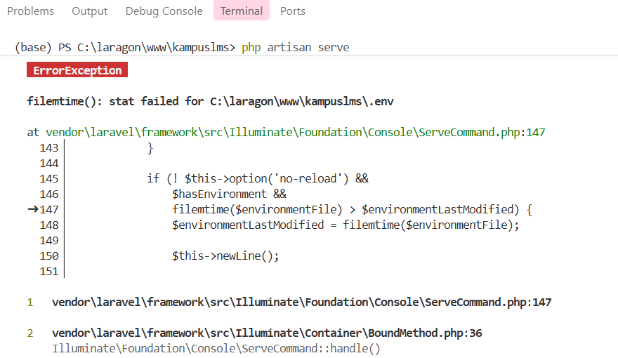
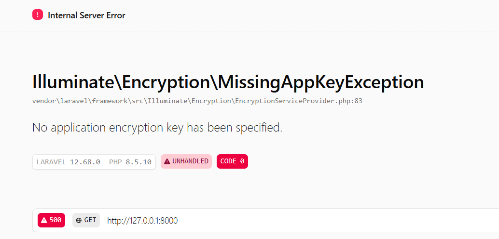
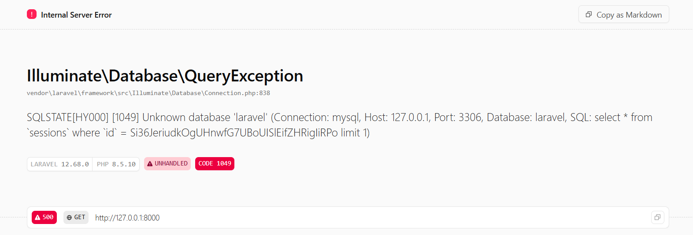

## Catatan Minggu 1 Pemrograman Web

**1. Buka `public/index.php`. Baca dari atas ke bawah. Tulis dalam 3 kalimat apa yang dilakukan berkas ini.**

Jawaban : File `index.php` digunakan untuk _entry point_ atau pintu masuk tiap kali ada yang buka website Laravel. File juga mengecek apakah web sedang _maintenance_ atau tidak, jika tidak file kemudian menyalakan Laravel. Lalu, _request_ dari pengguna diproses oleh Laravel dan hasilnya dikirim balik ke pengguna.


**2. Buka `bootstrap/app.php`. Identifikasi bagian mana yang mengurus route, mana yang mengurus middleware, mana yang mengurus exception.**

Jawaban : Bagian yang mengurus route yaitu `withRouting`, gunanya adalah untuk mengatur file mana yang berisi daftar route. 

```php
    ->withRouting(
        web: __DIR__.'/../routes/web.php',
        commands: __DIR__.'/../routes/console.php',
        health: '/up',
    )
```

 Bagian yang mengurus middleware yaitu `withMiddleware`, gunanya adalah melakukan verifikasi sebelum atau sesudah request di proses.

 ```php
     ->withMiddleware(function (Middleware $middleware) {
        //
    })
 ```

 Bagian yang mengurus exception yaitu `withException`, gunanya adalah untuk mengatur cara aplikasi menangani error.

 ```php
    ->withExceptions(function (Exceptions $exceptions) {
        //
    })
 ```

 **3. Buka `routes/web.php`. Temukan route yang menghasilkan halaman selamat datang. Ubah teksnya, muat ulang browser, pastikan berubah.**

 Jawaban : Jadi pada folder `routes` itu terdapat file `web.php` yang gunanya untuk mengatur alur ketika pengguna mengakses website. Jadi ketika pengguna membuka halaman utama, pengguna diarahkan ke halaman _Welcome_ yang tampilannya diatur pada file `welcome.blade.php` yang ada di folder `views`. Kalau mau mengganti teks, cara mengubahnya bisa di file `welcome.blade.php`

Tampilan Laravel sebelum diganti 
 

 Tampilan Laravel setelah diganti 


**4. Jalankan `php artisan route:list`. Cocokkan keluarannya dengan isi `routes/web.php`**

Jawaban : Perbandingan antara `php artisan route:list` dan `routes/web.php`

`php artisan route:list` = 

```cmd
  GET|HEAD  / ............................................................................................................. routes/web.php:5
  GET|HEAD  storage/{path} ............. storage.local › vendor/laravel/framework/src/Illuminate/Filesystem/FilesystemServiceProvider.php:98
  PUT       storage/{path} ..... storage.local.upload › vendor/laravel/framework/src/Illuminate/Filesystem/FilesystemServiceProvider.php:106
  GET|HEAD  up ................................. vendor/laravel/framework/src/Illuminate/Foundation/Configuration/ApplicationBuilder.php:219
```

`routes/web.php` =
``` php
<?php

use Illuminate\Support\Facades\Route;

Route::get('/', function () {
    return view('welcome');
});
```

---

| # | Yang dirusak | Prediksi Anda sebelum mencoba | Pesan error sebenarnya |
|---|--------------|-------------------------------|------------------------|
| 1 | Ganti nama .env menjadi .env.bak | Laravel akan error karena .env berisi database penting |  |
| 2 | Kosongkan nilai APP_KEY di .env | Website tetap bisa diakses tetapi muncul Error MissingAppKeyException |  |
| 3 | Ubah DB_DATABASE menjadi nama yang tidak ada | Website tidak bisa mengakses database |  |
| 4 | Ubah APP_DEBUG=false, lalu ulangi nomor 3 |  |  |