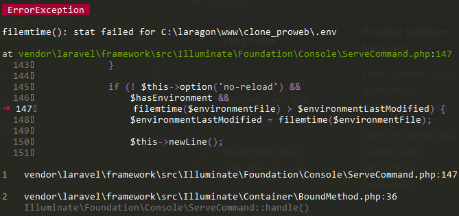
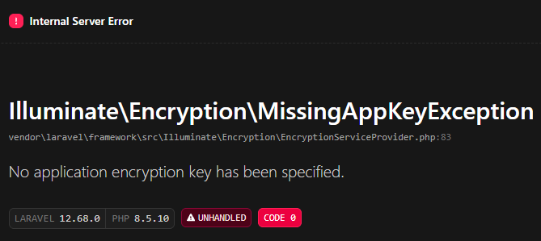
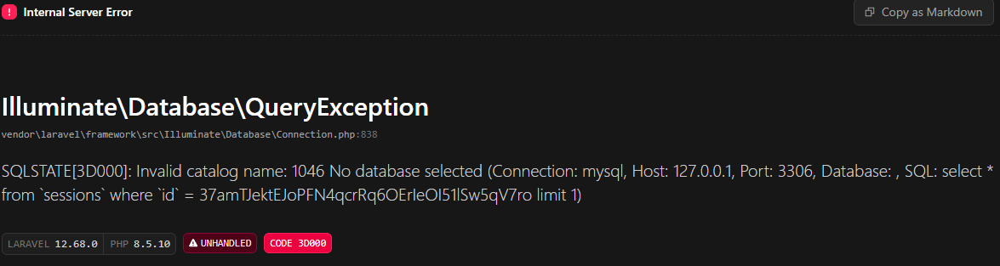

## Catatan minggu 1 Proweb

1. **Buka `public/index.php.` Baca dari atas ke bawah. Tulis dalam 3 kalimat apa yang dilakukan berkas ini.**

didalam folder public terdapat file `index.php` yang berguna untuk pintu masuk pengguna saat mengakses website yang mana file ini akan mengirimkan request bagi pengguna untuk mejalankan laravel, selain itu file ini juga bertugas memeriksa fungsi maintenance, composer autoloader, dan juga melakukan bootstrap, yng mana nanti setelah semua selesai request penggunakan akan diteruskan ke laravel.

---
2. **Buka `bootstrap/app.php.` Identifikasi bagian mana yang mengurus route, mana yang mengurus middleware, mana yang mengurus exception.**

pada folder bootstrap terdapat file `app.php` yang mana file ini berfungsi untuk mengatur jalannya website nanti, ada 3 hal yang di atur dalam `app.php` yaitu routing, middleware, dan exception.

#### Routing
```php
->withRouting(
        web: __DIR__.'/../routes/web.php',
        commands: __DIR__.'/../routes/console.php',
        health: '/up',
)
```

ini adalah bagian yang mengatur route yang mana ini berfungsi untuk mengurus halaman url pada web supaya laravel tahu harus menjalankan apa pada route.

#### Middleware
```php
->withMiddleware(function (Middleware $middleware): void {
        //
    })
```

ini adalah bagian yang mengatur middleware yang mana ini berfungsi sebagai verifikasi sebelum request dari pengguna dijalankan.

#### Exception
```php
->withExceptions(function (Exceptions $exceptions): void {
    //
})
```

ini adalah bagian yang menurus exception yang mana ini berfungsi sebagai penanganan jikalau saat program dijalankan mengalami error.

---
3. **Buka `routes/web.php.` Temukan route yang menghasilkan halaman selamat datang. Ubah teksnya, muat ulang browser, pastikan berubah.**

pada folder routes terdapat file `web.php` yang berfungsi sebagai pengatur alur saat pengguna mengakses website yang mana case ini kita akan di arahkan ke halaman welcome yang tampilannya diatur dalam file `welcome.blade.php` dalam folder `resource/views`, Jadi jika inbgin mengganti tampilan pada halaman welcome itu dilakukan pada file `welcome.blade.php`

### Tampilan sebelum diganti


### Tampilan setekah diganti


---
4. Jalankan `php artisan route:list`. Cocokkan keluarannya dengan isi `routes/web.php`

perbandingan kecocokan
### `php artisan route:list`
```cmd
GET|HEAD  / ....................................................................................... routes/web.php:5
  GET|HEAD  storage/{path} storage.local › vendor/laravel/framework/src/Illuminate/Filesystem/FilesystemServiceProvid…
  PUT       storage/{path} storage.local.upload › vendor/laravel/framework/src/Illuminate/Filesystem/FilesystemServic…
  GET|HEAD  up ........... vendor/laravel/framework/src/Illuminate/Foundation/Configuration/ApplicationBuilder.php:219

                                                                                                    Showing [4] routes
```

### `web.php`
```php
Route::get('/', function () {
    return view('welcome');
});
```

pada perbandingan diatas terdapat kecocokan pada route `GET|HEAD /` yang berasal dari `routes/web.php` pada baris ke-5 yang mana ini cocok dengan kode `Route::get('/')` pada file `web.php`.

| # | yang rusak | Prediksi Sebelum Mencoba | Pesan Error Sebenarnya |
| --- | --- | --- | :--- |
| 1 | Ganti nama `.env` menjadi `.env.bak` | Error, Karena `.env` menyimpan database penting |  |
| 2 | Kosongkan nilai `APP_KEY` di `.env` | Website masih bisa diakses tapi kehilangan keamanan | 
| 3 | Ubah `DB_DATABASE` menjadi nama yang tidak ada | website tidak bisa mengakses database | 
| 4 | Ubah `APP_DEBUG=false`, lalu ulangi nomor 3|